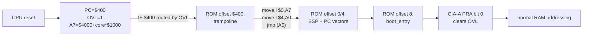

# Amiga compatibility

A working map of what's implemented on top of the 68k core to let
Amiga-shaped software run.  This is the user-facing companion to
[DESIGN.md](DESIGN.md) (CPU architecture) and [TESTING.md](TESTING.md)
(how each piece is verified).

## Boot path



The CPU's hardware `RESET_PC` is fixed at `$400` and per-core `A7` is
fixed at `$4000 + core*$1000` — we don't have a microcoded reset-vector
fetch.  Instead, **OVL routes the IF at `$400` to ROM offset `$400`**,
which is where we place a 3-instruction trampoline that does the
canonical 68000 reset-vector sequence: read SSP from `$0`, read PC from
`$4`, jump.  Functionally equivalent to a real Amiga boot — the
difference is software-in-ROM versus microcode-in-CPU.

To boot a real Kickstart binary:

```
make test-boot-rom-bin ROMFILE=path/to/your.rom ROMSIZE_WORDS=65536
```

The harness will load the binary into the ROM region, set `OVL_RESET=1`,
and run for 10 M cycles.  The tail of `[sim]` output tells you what
happened — see "What still hangs Kickstart" below.

## Chipset register coverage

Bus addresses our hardware actually responds to (some functionally,
some as canned read-only stubs, some as plain storage that round-trips):

### Agnus (live, inline in `m68k_bus.v`)

| addr      | reg       | direction | behavior                          |
|-----------|-----------|-----------|-----------------------------------|
| `$DFF002` | DMACONR   | R         | mirror of dmacon                  |
| `$DFF004` | VPOSR     | R         | bit 0 of high byte = agnus_v[8]   |
| `$DFF006` | VHPOSR    | R         | {agnus_v[7:0], agnus_h[7:0]}      |
| `$DFF096` | DMACON    | W         | SET/CLR semantics                 |
| `$DFF0E0` | BPL1PTH   | RW        | shadow, used by bitplane DMA      |
| `$DFF0E2` | BPL1PTL   | RW        | shadow, used by bitplane DMA      |

Beam counters tick every host clock; H wraps at 226 (227-cyc PAL line),
V wraps at 311 (312-line PAL frame).  Not slot-accurate vs real Agnus.

Agnus drives a `vblank_pulse_o` high for one host clock per frame (on
`(h, v) = (LAST_H, LAST_V)`); the bus wires it into Paula's
`vblank_int_i`, which edge-detects to set `INTREQ[5]` (VERTB).  With
INTEN+VERTB armed in INTENA, this raises IPL 3 and the CPU autovectors
through INT3 — the standard Kickstart system-tick hook path.

### Paula (live)

| addr      | reg       | behavior                          |
|-----------|-----------|-----------------------------------|
| `$DFF000` | AUDENA    | 4-bit audio DMA enable            |
| `$DFF01C` | INTENAR   | INTENA + INTREQ mirror (combined) |
| `$DFF01E` | INTREQR   | (same word as INTENAR)            |
| `$DFF09A` | INTENA    | SET/CLR, bit 14 = master INTEN    |
| `$DFF09C` | INTREQ    | SET/CLR, bits 13:0 = sources      |
| `$DFF0A0..A8` | AUD0LC/LEN/PER/VOL | channel 0          |
| `$DFF0B0..B8` | AUD1*                              |
| `$DFF0C0..C8` | AUD2*                              |
| `$DFF0D0..D8` | AUD3*                              |
| `$DFF020` | DSKPTH    | floppy DMA destination high       |
| `$DFF022` | DSKPTL    | floppy DMA destination low        |
| `$DFF024` | DSKLEN    | length + bit15 DMAEN -> triggers DMA |

Paula's interrupt priority encoder drives a 3-bit `irq_level` out to the
CPU.  Bit assignments match the canonical Amiga (PORTS at bit 3, BLIT
at bit 6, EXTER at bit 13, audio at bits 7-10).

### Paula RO stubs (canned values)

| addr      | reg     | reads as                          |
|-----------|---------|-----------------------------------|
| `$DFF010` | ADKCONR | 0                                 |
| `$DFF012` | POT0DAT | 0                                 |
| `$DFF014` | POT1DAT | 0                                 |
| `$DFF016` | POTGOR  | `$FFFF` (all buttons up)          |
| `$DFF018` | SERDATR | `$6000` (TSRE \| TBE)             |
| `$DFF00A` | JOY0DAT | 0                                 |
| `$DFF00C` | JOY1DAT | 0                                 |

Enough for Kickstart's early-init probes not to hang.  Joystick /
mouse / paddle / serial input is not wired up.

### Denise (live, via its own module)

`$DFF100-$DFF1FF` bank 0 (BPLCON0..3, BPL1DAT..BPL6DAT, COLOR00..31,
sprite registers, joystick collision), `$DFF300-$DFF3FF` bank 2 (HAM8
extension: extra bitplane pointers and 32 additional colors).

### Blitter (`$00FE_0000-$00FE_003F` + canonical `$DFF040-$DFF07F`)

Live.  Full copy/line/fill/BZERO, ASH/BSH barrel shifts, modulos, LF
minterm, line mode with octant + accumulator state.  Status at
`$00FE_003C` exposes BUSY and BZERO.

Canonical 16-bit writes to `$DFF040-$DFF07F` are bit-translated by the
bus into the internal 32-bit register layout:

| canonical | reg      | maps to internal                        |
|-----------|----------|------------------------------------------|
| `$DFF040` | BLTCON0  | merged into BLTCON (LF/ASH/USEA-D)       |
| `$DFF042` | BLTCON1  | merged into BLTCON (BSH/IFE/EFE/FCI/DESC/LINE/oct) |
| `$DFF044` | BLTAFWM  | BLTAFWM                                  |
| `$DFF046` | BLTALWM  | BLTALWM                                  |
| `$DFF048/A` | BLTCPTH/L | BLTCPT (high+low composed via canon-shadow) |
| `$DFF04C/E` | BLTBPTH/L | BLTBPT                                |
| `$DFF050/2` | BLTAPTH/L | BLTAPT                                |
| `$DFF054/6` | BLTDPTH/L | BLTDPT                                |
| `$DFF058` | BLTSIZE  | BLTSIZE (triggers blit)                  |
| `$DFF060` | BLTCMOD  | BLTCMOD (sign-extended)                  |
| `$DFF062` | BLTBMOD  | BLTBMOD                                  |
| `$DFF064` | BLTAMOD  | BLTAMOD                                  |
| `$DFF066` | BLTDMOD  | BLTDMOD                                  |
| `$DFF070` | BLTCDAT  | BLTCDAT                                  |
| `$DFF072` | BLTBDAT  | BLTBDAT                                  |
| `$DFF074` | BLTADAT  | BLTADAT                                  |

BLTCON0L / BLTSIZV / BLTSIZH (ECS-only) are dropped silently.
Reads of `$DFF040+` return the chipset-shadow round-trip value (the
last 16-bit value canonically written), not the internal 32-bit reg.

### Copper (`$00FE_0040-$00FE_007F` + canonical `$DFF080-$DFF08B`)

Live.  MOVE / WAIT / SKIP instructions, runs from a memory-resident
copper list.

Canonical 16-bit writes are translated:

| canonical | reg      | behavior                                |
|-----------|----------|------------------------------------------|
| `$DFF080/2` | COP1LCH/L | COP1LC (high+low composed)            |
| `$DFF084/6` | COP2LCH/L | COP2LC                                |
| `$DFF088` | COPJMP1  | strobe: restart Copper at COP1LC         |
| `$DFF08A` | COPJMP2  | strobe: restart at COP2LC                |
| `$DFF08C` | COPINS   | dropped (real Amiga: instruction RAM)    |
| `$DFF08E` | COPCON   | dropped (Copper DMA control)             |

Reads of `$DFF080+` return the chipset-shadow value.

### CIA-A and CIA-B

`$BFE001..$BFEF01` (CIA-A, 256-byte stride) and `$BFD000..$BFDF00`
(CIA-B).  PRA/PRB, DDRA/B, timer A/B (continuous + one-shot, IRQ on
underflow), 24-bit free-running TOD (`$08-$0A`), SDR (`$0C`),
read-and-clear ICR (`$0D`), CRA/CRB.

CIA-A drives `/OVL` on PRA bit 0 → bus clears OVL latch.

CIA-A also accepts keyboard-style serial byte injection: a CPU
write to `$00FE_9000` pulses the bus's `kbd_inject_wr` pin with the
written byte; CIA-A latches it into SDR and raises the SP-source
interrupt.

### Zorro II autoconfig

`$E80000-$E8FFFF` reads return `$FFFFFFFF` — "no autoconfig card
present" sentinel.  Writes drop silently.  Enough for Kickstart's
probe loop to terminate.

### Chipset shadow storage

Writes to these chipset addresses land in a 9-bit-indexed
storage block; reads return what was last written:

```
$DFF020-$DFF02E  DSK* (DSKDAT etc.) — DSKLEN itself is live
$DFF080-$DFF094  COPxLCH/L, COPJMP1/2, COPCON, DIWSTRT/STOP, DDFSTRT
$DFF098          CLXCON
$DFF0E0-$DFF0FF  BPL1..6PT
```

Real Kickstart writes a lot of bitplane setup state during init;
the shadow makes those writes observable on subsequent reads without
needing a functional slave for every register.

### Bitplane DMA (Agnus inline, multi-plane)

When `DMACON[8]` (BPLEN) AND `DMACON[9]` (DMAEN) are set AND
`BPLCON0[14:12]` (BPU) is non-zero, Agnus runs a multi-plane fetch
engine:

- On the rising edge of the engine being active (BPLEN & DMAEN & BPU>0),
  all six running pointers are reloaded from the chipset shadow at
  `chip_regs[$E0..$F6]` (BPL1PT..BPL6PT).
- Every 16 host clocks, one half-word is fetched from `mem[bpl_pt[i]]`
  into `BPLnDAT` for the current plane `i`, that plane's running
  pointer is advanced by 2, and `i` rotates `(i+1) mod BPU`.
- BPLCON0 is snooped from any write to `$DFF100` so the engine sees
  changes to BPU even when Denise also owns that address.

Limitations vs real Agnus:
- No DDFSTRT/DDFSTOP horizontal gating yet.
- No per-line modulo (BPLnMOD lives at `$DFF108+` in the Denise window
  which we don't snoop here); pointers run straight through memory.
- No slot-accurate interleaving vs blitter / copper / CPU.

Tests can verify the engine via probe addresses:

| addr           | reads as                          |
|----------------|-----------------------------------|
| `$00FE_9100`   | `bpl_fetches` — total counter     |
| `$00FE_9104`   | `BPL1DAT` in high 16 bits         |
| `$00FE_9108`   | `BPL2DAT` in high 16 bits         |
| `$00FE_910C`   | `BPL3DAT` in high 16 bits         |
| `$00FE_9110`   | `BPL4DAT` in high 16 bits         |
| `$00FE_9114`   | `BPL5DAT` in high 16 bits         |
| `$00FE_9118`   | `BPL6DAT` in high 16 bits         |
| `$00FE_911C`   | `BPLCON0` shadow (high 16)        |

### Block-device / hardfile

| addr           | reg          |
|----------------|--------------|
| `$00FE_8000`   | BLKSRC (sector #)                                 |
| `$00FE_8004`   | BLKDST (destination byte addr in main RAM)        |
| `$00FE_8008`   | BLKCNT (number of 512-byte sectors)               |
| `$00FE_800C`   | BLKCMD (write 1 = start; reads 0 when done)       |
| `$00400000+`   | disk image (read-only, loaded from DISK_HEXFILE)  |

Stands in for an A590-style SCSI autoconfig device.  Real Amiga
`trackdisk.device` would talk to the canonical DSKLEN path
(see Paula above) which now uses the same engine under the hood.

## What still hangs Kickstart

The "fake Kickstart" test (`make test-fake-kickstart`) walks 13 steps
of what real Kickstart 1.x does in its first thousand instructions
and currently passes all of them.  Beyond that point real Kickstart
will likely trip on:

1. **Bitplane DMA slot arbitration** — Multi-plane DMA fetches all
   six BPLnDAT registers (round-robin across BPU active planes), but
   Kickstart sets up a copper list expecting Agnus to interleave
   bitplane DMA with sprite, audio, blitter, refresh DMA in a fixed
   cycle pattern.  We have no slot scheduler; we also skip
   DDFSTRT/DDFSTOP gating and BPLnMOD modulos.  Anything that depends
   on cycle-accurate display timing will diverge.
2. **`exec.library` autoconfig of FAST RAM** — we return `$FFFFFFFF`
   from `$E80000` (= "no card") so Kickstart will only see CHIP
   RAM.  Workbench works with CHIP-only but is slower; some
   software refuses to boot without FAST.
3. **Real DSKBYTR + MFM decode** — `trackdisk.device` reads raw MFM
   from `DSKBYTR` and decodes blocks itself.  Our floppy DMA fakes
   the result by copying pre-decoded sector data straight to
   `mem[DSKPT]` — works if you patch `trackdisk.device`, fails for
   stock Kickstart.
4. **Keyboard handshake protocol** — `keyboard.device` does a
   request/acknowledge handshake over CIA-A SP/CNT.  We model only
   the byte-arrival path (raise SP interrupt with the byte in SDR).

These are progressive: even without fixing any of them you can boot
toward a "Kickstart screen" by feeding the system a patched ROM that
skips the trackdisk and keyboard waits.  Each fix above brings real
Kickstart closer to stock.

## What runs today

- **`make test-fake-kickstart`** — 13-step early-init pass on a
  synthetic Kickstart-shape ROM.
- **`make test-boot-rom-ext`** — VHPOSR + DMACON + SERDATR + POTGOR +
  CIA-A TOD + blitter copy under the OVL → trampoline → ROM path.
- **`make test-floppy`** — sector-DMA via canonical DSKLEN registers.
- **`make crosscheck-minimig`** — register-readback parity vs
  MiniMig's `paula_intcontroller`; 0 hard mismatches, 2 documented
  soft (MiniMig allows bit 14 of INTREQ as writable storage).
- All Amiga chipset demos (`demo-blt`, `demo-cop`, `demo-den`, etc.)
  run from `demos/*.s` against the full chipset.

See [TESTING.md](TESTING.md) for the full target list and per-test
descriptions.
