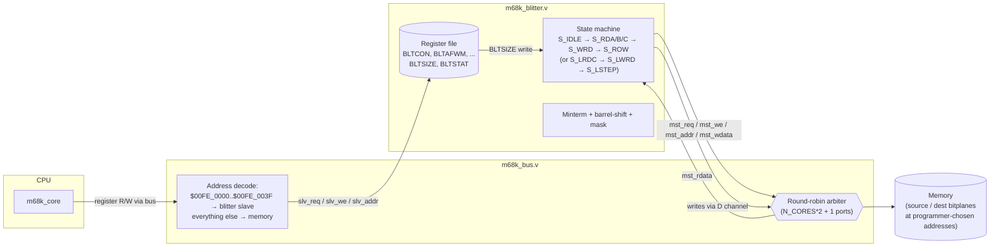

# Blitter (Amiga-inspired)

A clean-room hardware blitter modeled on the canonical Amiga blitter (HRM
chapter 6). It implements the same programming model — four channels
(A/B/C/D) over 16-bit words, an 8-bit minterm Logic Function combiner,
barrel shifts on A and B, first/last word masking on A, per-channel
modulo at the end of each row, and Bresenham line mode using A as the
DDA accumulator — but as new Verilog written against this design's bus
and clock model.

This is **Phase 1** of a larger Amiga-inspired chipset roadmap. Future
phases will add the Copper, a Denise-stand-in bitplane rasterizer, and a
Paula-stand-in audio engine. See [DESIGN.md § Future work](DESIGN.md).

## Architecture



The blitter has two interfaces to the bus:

- **Slave** (`blt_slv_*` in `m68k_bus.v`): the bus arbiter decodes addresses
  in `$00FE_0000..$00FE_003F` as blitter register accesses. CPU writes
  program the blitter; reads return register values.
- **Master** (port `2*N_CORES` of the arbiter): when running a blit, the
  blitter issues its own bus requests as just another bus master.
  Round-robin gives it fair access alongside the CPUs.

I/O reads of `$FE003C` (BLTSTAT) bypass the L1 D-cache so the BUSY bit
reflects current hardware state. The cache treats `[31:16] == $00FE` as
an I/O region (see `m68k_cache.v`).

## Register map

All registers are 32-bit, word-aligned. The Amiga's 16-bit PTH/PTL pairs
collapse into single 32-bit pointers here.

| Offset | Name      | Description                                                        |
|--------|-----------|--------------------------------------------------------------------|
| `$00`  | `BLTCON`  | Control: `{LF[7:0], ASH[3:0], BSH[3:0], 4'b0, LINE, oct[2:0], chan_en[7:0]}` |
| `$04`  | `BLTAFWM` | First-word mask for A (low 16 bits used).                          |
| `$08`  | `BLTALWM` | Last-word mask for A.                                              |
| `$0C`  | `BLTAPTH` | A pointer (byte address, must be word-aligned).                    |
| `$10`  | `BLTBPTH` | B pointer.                                                         |
| `$14`  | `BLTCPTH` | C pointer.                                                         |
| `$18`  | `BLTDPTH` | D pointer.                                                         |
| `$1C`  | `BLTAMOD` | Per-row modulo for A (signed; added to APT at end of each row).    |
| `$20`  | `BLTBMOD` | Modulo for B.                                                      |
| `$24`  | `BLTCMOD` | Modulo for C.                                                      |
| `$28`  | `BLTDMOD` | Modulo for D.                                                      |
| `$2C`  | `BLTADAT` | A data preset (low 16 bits; unused in copy mode).                  |
| `$30`  | `BLTBDAT` | B data preset / **line pattern** in line mode.                     |
| `$34`  | `BLTCDAT` | C data preset.                                                     |
| `$38`  | `BLTSIZE` | `{height[15:0], width-in-words[5:0]}`. **Writing starts a blit.**  |
| `$3C`  | `BLTSTAT` | RO: bit 0 = `BUSY`.                                                |

### BLTCON layout

```
 31    24 23   20 19   16 15  12 11 10 9 8 7   4 3 2 1 0
+--------+-------+-------+------+--+--+-+-+----+-+-+-+-+
|   LF   |  ASH  |  BSH  | 0000 |LN|SUD|SUL|AUL| 0000 |A|B|C|D|
+--------+-------+-------+------+--+--+-+-+----+-+-+-+-+
```

- **LF** — 8-bit Logic Function (truth table indexed by `{A_bit, B_bit, C_bit}`).
- **ASH / BSH** — barrel-shift count for the A / B channels (0..15).
- **LINE** — 1 = line mode, 0 = copy mode.
- **SUD / SUL / AUL** — octant control (see [Line mode](#line-mode)).
- **A / B / C / D** — channel enables.

## Copy mode

Iterates over `height × width` 16-bit words. For each word:

1. If A enabled: read `BLTAPT`, post-increment by 2.
   First-word: AND with `BLTAFWM`. Last-word: AND with `BLTALWM`.
2. If B enabled: read `BLTBPT`, post-increment by 2.
3. If C enabled: read `BLTCPT`, post-increment by 2.
4. Apply barrel shift to A and B (carry between successive words).
5. Compute `D = LF(A_shifted, B_shifted, C)`.
6. If D enabled: write `BLTDPT`, post-increment by 2.

End of row: `BLTxPT += BLTxMOD` per channel.

### Logic function examples

| LF      | Operation         |
|---------|-------------------|
| `$F0`   | `D = A`           |
| `$CC`   | `D = B`           |
| `$AA`   | `D = C`           |
| `$FC`   | `D = A OR B`      |
| `$C0`   | `D = A AND B`     |
| `$3C`   | `D = A XOR B`     |
| `$CA`   | `D = AB + ~A·C` (cookie-cutter / line) |
| `$00`   | `D = 0`           |
| `$FF`   | `D = 1`           |

The full 256-LF space is supported; the table above shows common idioms.

## Line mode

Bresenham line drawing. BLTSIZE.height is the line length in pixels; the
loop runs `height` iterations. Per pixel:

1. Read C at the current word containing the pixel.
2. Compute pixel mask `A = 1 << line_pos` (single-bit mask at the pixel's
   position).
3. Compute pattern bit from `BLTBDAT` rotated by `line_pattern_pos`.
4. Combine: `D = LF(A, B_pattern_word, C)`. With `LF=$CA` the cookie-cutter,
   `BLTBDAT=$FFFF`, this sets the pixel where the pattern bit is 1.
5. Write D at the current word.
6. Update `BLTAPT` (Bresenham accumulator) and step pointers per octant.

### Bresenham state

- `BLTAPT` — DDA accumulator. **Sign bit drives subordinate step.**
- `BLTAMOD` — increment when sign bit is clear: `4*(dy - dx)` (negative).
- `BLTBMOD` — increment when sign bit is set: `4*dy` (positive).

Initial `BLTAPT = 4*dy - 2*dx` (Bresenham initial value).

### Octants (BLTCON[10:8] = {SUD, SUL, AUL})

```
+-----+-----+-----+----------------------------------------------+
| SUD | SUL | AUL | meaning                                      |
+-----+-----+-----+----------------------------------------------+
|  0  |  0  |  0  | +X dom, +Y sub  (octant 0: x→x+1, y→y+1)     |
|  0  |  0  |  1  | +Y dom, +X sub                                |
|  0  |  1  |  0  | +X dom, -Y sub                                |
|  0  |  1  |  1  | -Y dom, +X sub  (wait: sud=0,sul=1,aul=1 -> Y dom, sud=0=+Y means dominant +Y; sul=1=-X. Y dom +Y, X sub -X.) |
|  1  |  0  |  0  | -X dom, +Y sub                                |
|  1  |  0  |  1  | +Y dom, -X sub                                |
|  1  |  1  |  0  | -X dom, -Y sub                                |
|  1  |  1  |  1  | -Y dom, -X sub                                |
+-----+-----+-----+----------------------------------------------+
```

`AUL` selects which axis is dominant. `SUD` is the dominant-axis sign;
`SUL` is the subordinate-axis sign.

### Bit-position convention

Per Amiga semantics:

- pixel `x` of a scanline lives in bit `15 - (x mod 16)` of word `x / 16`.
- pixel `(0, 0)` is bit 15 of the first word.
- `ASH = x_start mod 16`. The blitter initialises `line_pos = 15 - ASH`.

## Driving the blitter from asm

A typical program:

```asm
        ; ---- copy mode: D = A OR B over 8 words, 1 row ----
        move.l  #$FC00000D, $00FE0000   ; BLTCON: LF=$FC, USEA|USEB|USED
        move.l  #$0000FFFF, $00FE0004   ; BLTAFWM (no first-word mask)
        move.l  #$0000FFFF, $00FE0008   ; BLTALWM
        move.l  #$00002000, $00FE000C   ; BLTAPT  = source A
        move.l  #$00002100, $00FE0010   ; BLTBPT  = source B
        move.l  #$00003000, $00FE0018   ; BLTDPT  = dest
        move.l  #0,         $00FE001C   ; BLTAMOD
        move.l  #0,         $00FE0020   ; BLTBMOD
        move.l  #0,         $00FE0028   ; BLTDMOD

        ; BLTSIZE: height in [21:6], width in [5:0]. (1 << 6) | 8 = $48.
        move.l  #$00000048, $00FE0038

        ; ---- poll BUSY ----
wait:   move.l  $00FE003C, D0
        andi.l  #1, D0
        bne     wait
        ; blit complete
```

For line drawing, see `demos/blt_demo.s` and `tests/t22_blt_line.s`.

## Differences from the real Amiga blitter

Intentional deviations for fit with our design:

| Real Amiga                            | This blitter                                    |
|---------------------------------------|--------------------------------------------------|
| 16-bit register pairs (PTH/PTL)       | 32-bit pointers (one register each)             |
| 21-bit addresses (chip RAM)           | Full 32-bit byte addresses                      |
| Register page at `$DFF040..$DFF076`   | `$00FE_0000..$00FE_003F`                        |
| 4-cycle slot DMA arbitration          | Round-robin arbiter (whatever wins, runs)       |
| 16 max addressable lines via copper   | No copper yet — CPU programs directly           |
| Fill mode (FCI/IFE/EFE)               | **NOT implemented** (deferred to a later pass)  |
| Descending mode (DESC)                | **NOT implemented**                             |
| Blitter interrupt to CPU (INT6)       | Polled BUSY only (interrupt wiring is future)   |
| BLTBYP / blitter-priority registers   | Not modeled                                     |

What **is** identical: register layout, BLTCON field meanings, channel
enable bits, minterm Logic Function semantics, barrel shifts, first/last
word masking, Bresenham state machine, octant decoding, line pattern
rotation, modulo handling at end of row.

## Bus protocol

The blitter issues one bus transaction per channel access. For copy mode
with all four channels enabled, each blit word costs four bus cycles
(A read, B read, C read, D write). With round-robin and 2 CPU cores, the
blitter sees 1/5 of the bus slots, so its effective throughput is roughly
`bus_freq / 5 / 4 ≈ 5% × bus_freq` words per second. Programs that need
both CPU and blitter throughput should keep blits short and interleave.

The `mst_req` signal drops combinationally on `mst_ack` to keep the
arbiter's "one grant per transaction" invariant — the same trick the
cache and passthrough modules use.

## Tests

| test            | covers                                                       |
|-----------------|--------------------------------------------------------------|
| `t19_blt_copy`  | A → D long copy (LF=$F0, no mask, no shift).                 |
| `t20_blt_logic` | OR and AND minterms (LF=$FC, $C0) with USEA+USEB+USED.       |
| `t21_blt_shift` | Barrel shift (ASH=4) + first/last word masks combined.       |
| `t22_blt_line`  | Single pixel, 4-pixel horizontal line, 4-pixel diagonal.     |

All four pass under the regular `make test` flow.

## Demo

`demos/blt_demo.s` animates a sunburst pattern: each frame draws one new
line from the screen center (128, 96) to a point on a circle of radius 60
at one of 16 angles. The angle index advances each frame and the bitplane
is cleared every 64 frames. Run with:

```sh
make demo-blt
```

This opens the SDL window over the 1bpp bitplane region at `$00020000`,
which the harness overlays as white pixels on top of the (empty) chunky
framebuffer. You should see a rotating spoke that accumulates into a
star, then resets.

## What's next

Phase 2 (Copper) will let the blitter be programmed by a memory-resident
display list instead of CPU register writes — true "fire and forget"
acceleration. Phase 3 (Denise stand-in) will add a bitplane-to-chunky
rasterizer so multi-plane bitmaps and the canonical Amiga palette become
first-class. Phase 4 (Paula) adds 4-voice audio routed through SDL2.
