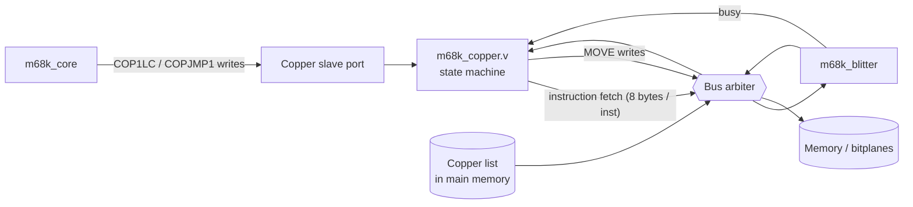
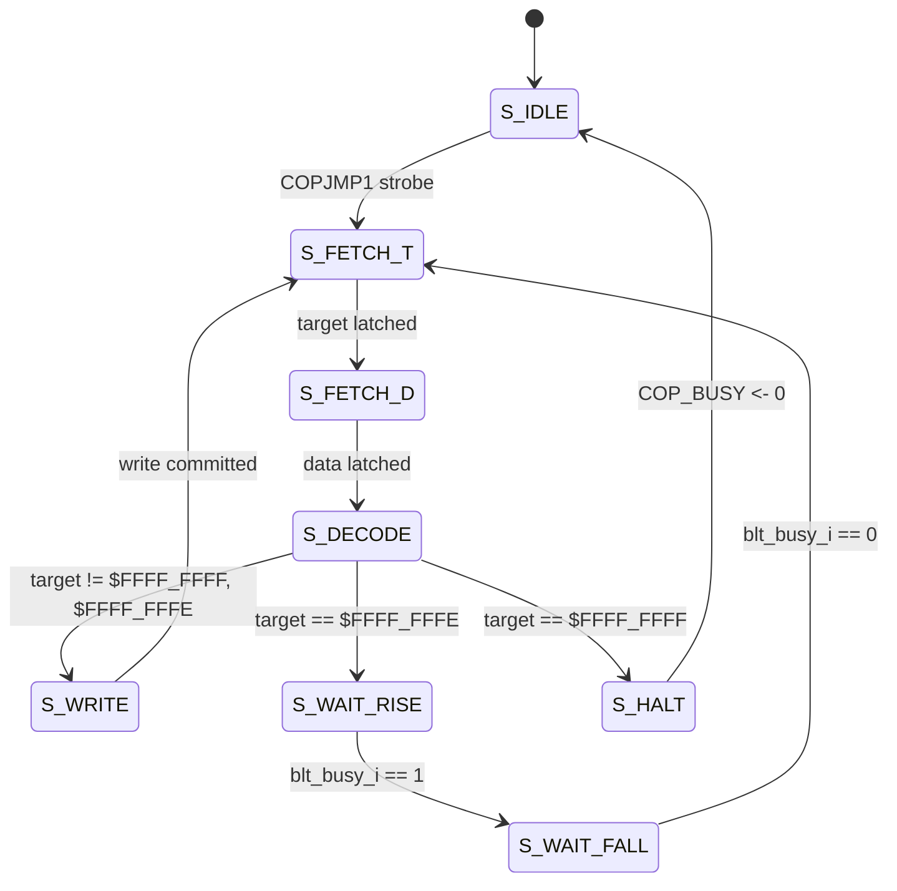

# Copper (Amiga-inspired display-list coprocessor)

A small clean-room display-list coprocessor, Phase 2 of the Amiga-inspired
chipset roadmap. The Copper reads a memory-resident program — the "Copper
list" — and executes it autonomously on its own bus master port, with no
CPU involvement after startup. Its job is to reprogram chip registers
(notably the blitter) and synchronize with hardware events.

## Architecture



The Copper sits on the bus as a **second master** alongside the blitter
(`COP_PORT = 2*N_CORES + 1` in `m68k_top.v`). Round-robin gives it fair
access; with N=2 cores it sees roughly 1/6 of the bus slots.

The Copper module exposes a slave interface for the CPU to program (the
list pointer and the start-strobe), and consumes the blitter's `busy_o`
signal so it can implement `WAIT for blitter-not-busy`.

## Instruction encoding

Unlike the real Amiga's 16-bit-word instructions, this Copper uses
**8-byte (two-long) instructions** to match the 32-bit-wide bus:

```
+---------------------+---------------------+
|     target (long)   |     data (long)     |
+---------------------+---------------------+
```

Special target values:

| `target`        | Meaning                                                  |
|-----------------|----------------------------------------------------------|
| `$FFFF_FFFF`    | `HALT` — stop the Copper. `COP_BUSY` clears.             |
| `$FFFF_FFFE`    | `WAIT` — block until the blitter goes busy then idles.   |
| anything else   | `MOVE` — write `data` (32 bits) to address `target`.     |

`MOVE` writes are 32-bit-wide with `be = 4'b1111`. They are routed
exactly like CPU writes; targets in the chip-register range
(`$00FE_0000..$00FE_007F`) land on the blitter / Copper slave ports;
anything else writes to memory.

## CPU-facing registers

| Offset (from `$00FE_0040`) | Name      | Description                                |
|----------------------------|-----------|--------------------------------------------|
| `$00FE_0040`               | `COP1LC`  | RW: 32-bit byte address of list start.     |
| `$00FE_0044`               | `COPJMP1` | W : write any value to (re)start the Copper at `COP1LC`. Ignored while `COP_BUSY=1`. |
| `$00FE_0048`               | `COPSTAT` | RO: bit 0 = `COP_BUSY`.                    |

CPU programming sequence:

```asm
        move.l  #copper_list, $00FE0040    ; COP1LC
        move.l  #1, $00FE0044              ; COPJMP1: strobe-start
wait:   move.l  $00FE0048, D0              ; COPSTAT
        andi.l  #1, D0
        bne     wait                       ; spin until COP_BUSY clears
```

## WAIT semantics

Because we have no Denise / no raster generator yet, the only meaningful
WAIT condition is "blitter not busy". The Copper handles this in two
sub-states:

1. `S_WAIT_RISE` — block until `blt_busy_i` is observed `1` (ensures the
   previously-issued `MOVE` to `BLTSIZE` has actually started the blit).
2. `S_WAIT_FALL` — block until `blt_busy_i` returns to `0`.

This two-step approach avoids the race where the Copper races past a
`BLTSIZE` write before the blitter actually latches it. It mirrors the
"wait until blitter finishes the just-started blit" expectation that
Amiga Copper code relies on (with the BFD bit set).

The state diagram:



## Programming model

The canonical pattern is a CPU one-time setup followed by repeated
strobes of `COPJMP1`. The Copper list typically alternates `MOVE` blocks
that program a chip register set (e.g., the full 11+ blitter registers
for a single blit) with `WAIT` instructions that yield until the
previous operation finishes.

A minimal Copper list that drives the blitter once and stops:

```asm
copper_list:
        ; ---- program blitter for a copy ----
        .long   $00FE0000, $F0000009    ; MOVE BLTCON  = LF=$F0, USEA|USED
        .long   $00FE0004, $0000FFFF    ; MOVE BLTAFWM = no mask
        .long   $00FE0008, $0000FFFF    ; MOVE BLTALWM = no mask
        .long   $00FE000C, $00002000    ; MOVE BLTAPT  = source
        .long   $00FE0018, $00003000    ; MOVE BLTDPT  = dest
        .long   $00FE001C, 0            ; MOVE BLTAMOD = 0
        .long   $00FE0028, 0            ; MOVE BLTDMOD = 0
        .long   $00FE0038, $00000044    ; MOVE BLTSIZE - STARTS THE BLIT
        .long   $FFFFFFFE, 0            ; WAIT for blitter
        .long   $FFFFFFFF, 0            ; HALT
```

Once kicked, the Copper executes 32 reads (8 long-word fetches × 2 longs
each + 0 for the special-target HALT) and 8 writes, then clears
`COP_BUSY`. CPU side just polls `COPSTAT`.

## Differences from the real Amiga Copper

| Real Amiga                                | This Copper                                          |
|-------------------------------------------|------------------------------------------------------|
| Two 16-bit instruction words              | Two 32-bit instruction longs                         |
| MOVE: 9-bit register offset, 16-bit data  | MOVE: 32-bit address, 32-bit data                    |
| WAIT for raster vertical + horizontal     | WAIT for blitter-not-busy only (no raster yet)       |
| SKIP for blitter priority                 | Not implemented                                      |
| Two parallel lists (COP1, COP2)           | Single list                                          |
| Raster-position triggered restart         | CPU strobes `COPJMP1`                                |
| Disabled by DMACON.COPEN                  | No global enable; just kick or don't                 |
| `$DFF080..$DFF08E` register page          | `$00FE_0040..$00FE_007F`                             |
| End-of-list = `$FFFE FFFE` (WAIT forever) | End-of-list = target `$FFFF_FFFF` (explicit HALT)    |

What **is** identical in spirit:

- Memory-resident, fetched-on-the-fly instruction stream
- The Copper as an independent bus master synchronizing with another
  chip (here, just the blitter; on Amiga, blitter + Denise + Paula)
- The Programming pattern of "one MOVE per chip register" rather than
  CPU mediation per write

## Tests

| test            | covers                                                      |
|-----------------|-------------------------------------------------------------|
| `t23_cop_basic` | Two MOVEs to plain memory addresses, then HALT.             |
| `t24_cop_chain` | Copper programs the blitter (12 MOVEs), WAITs for blitter, then HALTs. CPU verifies the blit result. |

Both run inside `make test` alongside the rest of the regression suite.

## Demo

`demos/cop_demo.s` builds a Copper list once at boot, then in the main
loop pokes `COPJMP1` over and over. Each kick, the Copper:

1. Clears the bitplane (4 blitter register MOVEs + WAIT).
2. Draws a horizontal line at y=96 (12 MOVEs + WAIT).
3. Draws a vertical line at x=128 (8 MOVEs + WAIT).
4. HALTs.

The result is a static cross visible in the SDL window. CPU work per
frame is one register write (the COPJMP1 strobe) plus the poll loop —
all the blitter setup work is offloaded.

Run via:

```sh
make demo-cop
```

## What's next

**Phase 3** will add a Denise-stand-in: a bitplane-to-chunky rasterizer
running on our existing 8 bpp framebuffer. It will read 1–6 planes from
chip memory, mix per the 32-entry palette, and write the result into the
visible framebuffer. The Copper's MOVE targets will expand to include
the new Denise-shadow registers (BPLCON, COLOR00–COLOR1F, BPLxPT, etc.).
With Copper + Denise, palette bars and mid-line palette changes ("copper
bars") become possible.

**Phase 4** is Paula audio. Not visual, so largely independent of the
existing framework.
