# Denise (bitplane rasterizer)

Phase 3 of the Amiga-inspired chipset. Denise reads up to 6 planar
bitplanes from memory, combines them per pixel according to the
configured display mode, looks up a 12-bit RGB color from the 32-entry
palette, and writes the result as 8 bpp RGB332 bytes into the chunky
framebuffer at `$00010000`.

The result appears in the existing SDL window — no display-pipeline
changes needed. Denise is just a producer of chunky pixels.

## Architecture

```mermaid
flowchart LR
    subgraph CTRL["CPU / Copper"]
        REG["Register writes:<br/>BPLCON0/1/2, BPLxPT,<br/>BPLxMOD, COLOR00..1F"]
    end
    subgraph BUS["m68k_bus.v"]
        ARB{{Arbiter<br/>(blt + cop + den + cores)}}
        DEC["Address decode:<br/>$00FE_0100..$00FE_01FF<br/>→ Denise slave"]
    end
    subgraph DEN["m68k_denise.v"]
        FSM["Row × word-group<br/>state machine"]
        PAL[("Palette<br/>32 × 12-bit RGB")]
        HAM["HAM6 prev-color<br/>(reset per row)"]
        FSM <--> PAL
        FSM <--> HAM
    end
    CTRL --> DEC --> DEN
    DEN -- "plane-word reads" --> ARB --> MEM[("Bitplane memory<br/>(BPLxPT)")]
    DEN -- "chunky pixel writes" --> ARB --> FB[("Chunky FB<br/>$00010000<br/>(rendered by SDL)")]
```

## Supported display modes

| Mode      | nplanes | BPLCON0 flags    | Effect                                                |
|-----------|---------|------------------|-------------------------------------------------------|
| Indexed   | 1..6    | HAM=0, DPF=0     | Direct palette lookup with up to 32 colors.           |
| HAM6      | 6       | HAM=1            | Hold-and-modify; 4 control modes per pixel.           |
| EHB       | 6       | HAM=0, DPF=0     | Bit 5 of pixel = half-brite flag; 5-bit palette idx. |
| DPF       | 2,4,6   | DPF=1            | Two playfields; planes split odd/even; priority via BPLCON2. |

EHB is automatically inferred when `nplanes == 6 && !HAM && !DPF`.

### HAM6 detail

Each 6-bit pixel value `V` is `{ctrl[1:0], data[3:0]}`. The control
bits select how the pixel is rendered relative to the previous pixel
in the same scanline:

| `ctrl` | Action                                         |
|--------|------------------------------------------------|
| `00`   | USE `palette[data]` (palette[0..15])           |
| `10`   | Modify R: `cur = {data, prev.G, prev.B}`       |
| `01`   | Modify B: `cur = {prev.R, prev.G, data}`       |
| `11`   | Modify G: `cur = {prev.R, data, prev.B}`       |

`prev` is initialized to `COLOR00` at the start of every scanline.

### EHB detail

```
palette_idx = V[4:0]
color       = palette[palette_idx]
if V[5]: color.R >>= 1; color.G >>= 1; color.B >>= 1
```

### Dual-playfield detail

```
pf1_idx = {pv[4], pv[2], pv[0]}   (planes 0, 2, 4 contribute)
pf2_idx = {pv[5], pv[3], pv[1]}   (planes 1, 3, 5 contribute)

priority = BPLCON2[6]  ; 0 = PF1 in front (default), 1 = PF2 in front

select winning playfield's pixel index; PF2 colors are palette[8..15],
PF1 colors are palette[0..7].  If both PFs are "background" (idx 0),
output COLOR00.
```

## Register map

The Denise register page sits at `$00FE_0100..$00FE_01FF` (256 bytes).

| Offset | Name     | Description                                                |
|--------|----------|------------------------------------------------------------|
| `$00`  | BPLCON0  | `[14:12]` nplanes, `[11]` HAM, `[10]` DPF                  |
| `$04`  | BPLCON1  | reserved (future: horizontal scroll)                       |
| `$08`  | BPLCON2  | `[6]` PF2 priority (DPF only)                              |
| `$10`  | BPL1PT   | byte address of plane 0 (low memory)                       |
| `$14`  | BPL2PT   | plane 1                                                    |
| `$18`  | BPL3PT   | plane 2                                                    |
| `$1C`  | BPL4PT   | plane 3                                                    |
| `$20`  | BPL5PT   | plane 4                                                    |
| `$24`  | BPL6PT   | plane 5                                                    |
| `$28`  | BPL1MOD  | end-of-row signed bonus for odd planes (0, 2, 4)           |
| `$2C`  | BPL2MOD  | end-of-row signed bonus for even planes (1, 3, 5)          |
| `$40`  | DENRUN   | W: write any value to trigger full-frame raster            |
| `$44`  | DENSTAT  | RO: bit 0 = `DEN_BUSY`                                     |
| `$80`  | COLOR00  | 12-bit RGB in low 12 bits (`$0RGB`)                        |
| `$84`  | COLOR01  | ...                                                        |
| ...    | ...      | ...                                                        |
| `$FC`  | COLOR1F  | last palette entry (32 total)                              |

Palette entries are `{r[3:0], g[3:0], b[3:0]}` in the low 12 bits. The
rasterizer downscales to RGB332 as it writes the chunky framebuffer
(`R332 = R[3:1]`, `G332 = G[3:1]`, `B332 = B[3:2]`).

## Memory layout

The CPU (or Copper, or blitter) is responsible for placing planar
bitplane data in memory. A typical 256×192, 6-plane image is
`6 × 6144 = 36864` bytes. Allocate each plane on a fresh long-aligned
boundary; suggested layout:

| Plane | Default byte address |
|-------|-----------------------|
| 0     | `$00020000`           |
| 1     | `$00021800`           |
| 2     | `$00023000`           |
| 3     | `$00024800`           |
| 4     | `$00026000`           |
| 5     | `$00027800`           |

The chunky framebuffer remains at `$00010000` (48 KB, 256×192 bytes).

Bitplane format: each row is 32 bytes = 16 16-bit words. Bit 15 of each
word is the leftmost pixel of that word; bit 0 is the rightmost. Plane
`i` contributes bit `i` of each pixel's index value (plane 0 = LSB).

## Rasterizer state machine

```mermaid
stateDiagram-v2
    [*] --> S_IDLE
    S_IDLE --> S_ROW_INIT: DENRUN write
    S_ROW_INIT --> S_WG_INIT: prev_color := COLOR00
    S_WG_INIT --> S_FETCH_P: zero counters
    S_FETCH_P --> S_FETCH_P: read plane[pi_idx]; pi_idx++
    S_FETCH_P --> S_PROC: pi_idx >= nplanes
    S_PROC --> S_PROC: pack pixel px_idx into 128-bit pixel_buf; px_idx++
    S_PROC --> S_WRITE: px_idx == 15
    S_WRITE --> S_WRITE: write long wr_long_idx of pixel_buf; wr_long_idx++
    S_WRITE --> S_NEXT_WG: wr_long_idx == 3
    S_NEXT_WG --> S_FETCH_P: wg_idx < 15
    S_NEXT_WG --> S_ROW_END: wg_idx == 15
    S_ROW_END --> S_ROW_INIT: row_idx < FB_H - 1
    S_ROW_END --> S_DONE: row_idx == FB_H - 1
    S_DONE --> S_IDLE: DEN_BUSY <- 0
```



Per word-group: `nplanes` plane reads, 16 sequential pixel-pack cycles,
4 long writes. Per row: 16 word-groups + modulo update. Per frame:
192 rows. Approximately 250K-300K simulator cycles per Denise raster.

## Differences from real Denise

This is a clean-room rasterizer with the Amiga's programming model but
deliberately scoped:

| Real Denise / ECS Denise / AGA          | This implementation                            |
|------------------------------------------|------------------------------------------------|
| Continuous scan-out pixel-by-pixel       | One-shot full-frame raster on DENRUN trigger   |
| Composite/RGB video output               | Writes chunky bytes to memory; SDL renders it  |
| 16-bit registers in `$DFF180..$DFF1BE`   | 32-bit registers in `$00FE_0180..$00FE_01FC`   |
| 8 hardware sprites with collision        | **Not implemented** (future)                   |
| BPLCON1 horizontal scroll                | **Not implemented**                            |
| Hires (640px) mode                       | **Not implemented** (we are 256 wide)          |
| Lores (320px) + interlace                | We render at 256×192 directly                  |
| HAM8 (AGA only)                          | **Not implemented**                            |
| Genlock / overlay                        | Not applicable                                 |

What **is** identical in spirit:

- Up to 6 planes, planar bitplane format, plane 0 = LSB of pixel
- 12-bit palette (4 bits per channel)
- HAM6 with the 4 control modes, prev-color reset per scanline
- EHB inferred from `nplanes=6` + no HAM/DPF
- Dual playfield with PF2 priority bit
- Per-row modulos for end-of-line stride

## Tests

| test               | covers                                                  |
|--------------------|---------------------------------------------------------|
| `t25_den_indexed`  | nplanes=0 fills FB with COLOR00; nplanes=1 with a bit pattern |
| `t26_den_ham`      | HAM6 four control modes on pixels 0..3                  |
| `t27_den_ehb`      | EHB half-brite on pixel V=33 vs V=1                     |
| `t28_den_dpf`      | DPF priority with two playfields; BPLCON2[6] flip       |

All four pass under `make test`. Together with the existing tests, the
suite is now 28 tests.

## Demo

`demos/den_demo.s` fills 4 bitplanes with simple repeating bit patterns
(each plane: `$FF`, `$F0`, `$CC`, `$AA` masks respectively), programs a
16-color palette, sets `BPLCON0 = $4000` (4 planes), and re-triggers
DENRUN in an infinite loop. The result is a fixed pattern of 16 vertical
color bands repeated across the screen.

Run via:

```sh
make demo-den
```

## What's next

**Phase 4 — Paula audio**: 4-voice 8-bit PCM with period/volume DMA
registers, routed through SDL_audio so you actually hear it.

Future Denise extensions (not Phase 3):
- Hardware sprites (8 sprites with collision)
- BPLCON1 horizontal scroll for parallax
- Display window registers (DIWSTRT/DIWSTOP)
- True per-line scan-out (so Copper mid-line palette changes work)
