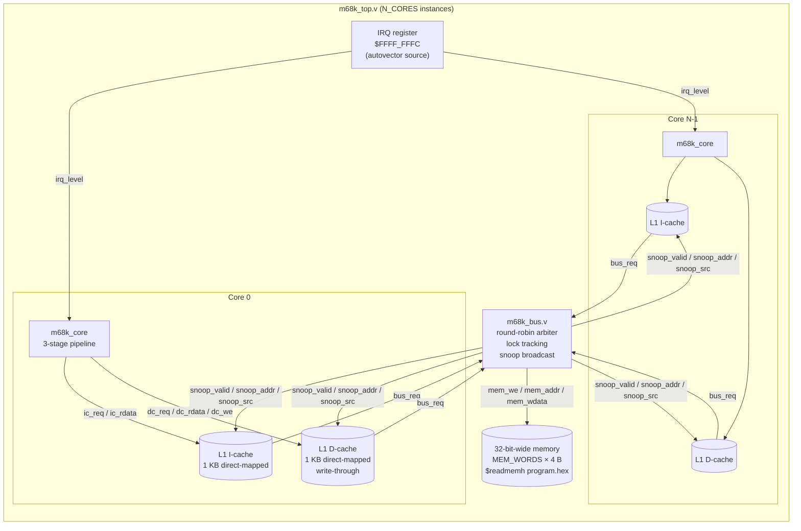
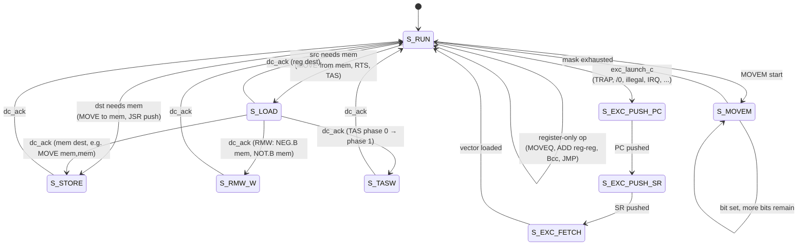
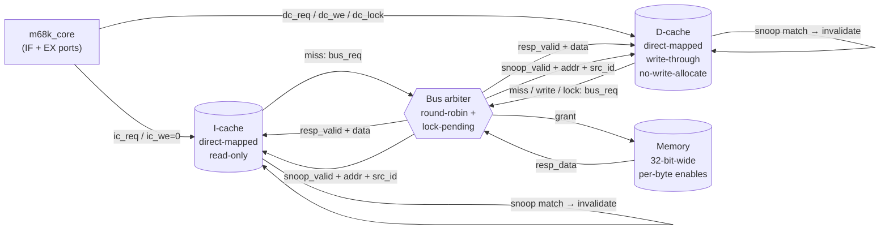
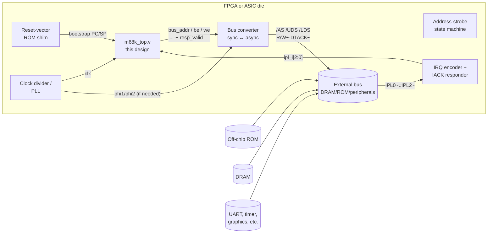
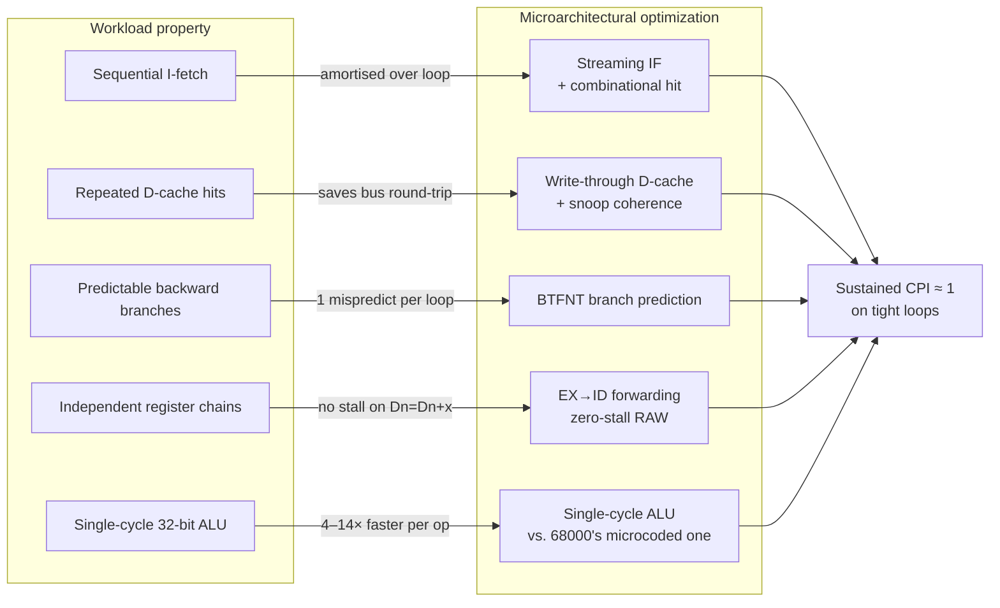

# fast_68000: Design Document

A pipelined, cached, multi-core implementation of a Motorola 68000 instruction
set subset, written in Verilog and verified with Verilator. Built to exhibit
the classic CPU microarchitecture optimizations — pipelining with forwarding,
private L1 caches with snoop-based coherence, atomic locked RMW operations
for inter-core synchronisation, and static branch prediction — and to quantify
their impact against the published 68000 timing table.

Final headline numbers on this design:

```
benchmark   retired  68k_ref cpi_ref    fast cpi_fast    slow cpi_slow  vs_68k  vs_slow
fib             105      718    6.84     133     1.27     338     3.22   5.40x    2.54x
jsr             304     3334   10.97     934     3.07    1835     6.04   3.57x    1.96x
memcopy         458     4286    9.36     888     1.94    1669     3.64   4.83x    1.88x
sum             404     4034    9.99     632     1.56    1835     4.54   6.38x    2.90x
```

`vs_68k` is the ratio of canonical M68000 PRM cycles to our cycles for the
same instruction stream. The cached + pipelined build finishes the same
benchmark programs in **3.6×–6.4× fewer clock cycles** than a textbook 68000
would. `vs_slow` isolates the cache contribution by comparing against a
no-cache build of the same pipeline.

---

## Table of contents

1. [Goals and non-goals](#goals-and-non-goals)
2. [ISA: 68K-mini](#isa-68k-mini)
3. [System architecture](#system-architecture)
4. [Pipeline microarchitecture](#pipeline-microarchitecture)
5. [Memory subsystem](#memory-subsystem)
6. [Multi-core, coherence, atomics](#multi-core-coherence-atomics)
7. [Exception and interrupt handling](#exception-and-interrupt-handling)
8. [Optimizations](#optimizations)
9. [Module reference](#module-reference)
10. [Verification methodology](#verification-methodology)
11. [Benchmarks](#benchmarks)
12. [Build and run](#build-and-run)
13. [Hardware integration: replacing a real 68000](#hardware-integration-replacing-a-real-68000)
14. [Performance benefits: what workloads benefit most](#performance-benefits-what-workloads-benefit-most)
15. [ISA implementation status](#isa-implementation-status)
16. [Future work](#future-work)
17. [File map](#file-map)

---

## Goals and non-goals

**Goals.**

- Faithfully implement enough of the M68000 ISA to run interesting hand-written
  programs (arithmetic, loops, subroutines, memory streaming, inter-core
  synchronisation via TAS).
- Pipeline the core with hazard forwarding and a static branch predictor.
- Build a coherent memory hierarchy with per-core L1 caches, write-through
  with snoop-invalidate, and atomic locked transactions.
- Scale to N cores parameterically.
- Verify with Verilator and a small regression + benchmark suite, with a
  reference comparison against the canonical 68000 cycle counts.

**Explicit non-goals.**

- Cycle-accurate emulation of the real 68000. We pick a subset of the ISA and
  measure clock cycles on our own implementation, then compare against PRM
  per-instruction cycle counts.
- Bit-exact behaviour on every corner of the ISA. The exception frame is
  non-standard (8 bytes instead of 6), `d8(An,Xn)` indexed modes and BCD
  arithmetic are not implemented, and interrupt acknowledgment is autovector
  only. See [ISA implementation status](#isa-implementation-status) for a
  precise list.
- Hardware synthesis. Designed for clarity in simulation; gate-level timing
  was not analysed. Real silicon would need further work (clock-domain
  consideration, retiming, ASIC/FPGA targeting) — covered in detail in
  [Hardware integration](#hardware-integration-replacing-a-real-68000).

---

## ISA: 68K-mini

A 32-bit datapath implementing a broad subset of the M68000, including all
three operand sizes (.B / .W / .L), user and supervisor modes, the standard
exception model, and autovector interrupts. The full opcode encoding is
documented in `ISA.md`; see [ISA implementation status](#isa-implementation-status)
near the end of this document for a precise inventory of what's implemented,
decoded-but-not-executed, and skipped. The summary below captures the
foundational pieces.

### Registers

| name      | description                                                       |
|-----------|-------------------------------------------------------------------|
| D0..D7    | 32-bit data registers                                             |
| A0..A7    | 32-bit address registers; A7 is the stack pointer (SP)            |
| PC        | 32-bit program counter                                            |
| CCR       | condition codes: N, Z, V, C                                       |

The register file (`m68k_regfile.v`) is a 16-entry flat array indexed by a
4-bit number with bit 3 selecting data (0) vs. address (1). It exposes three
read ports (source, destination/Dn-operand, SP) and one main write port plus
one auxiliary write port. The auxiliary port commits address-register updates
from auto-increment/decrement and SP push/pop in the same cycle as the main
result writeback.

### Addressing modes

| mode | reg | meaning                                                       |
|------|-----|---------------------------------------------------------------|
| 000  | r   | Dr (data register direct)                                     |
| 001  | r   | Ar (address register direct)                                  |
| 010  | r   | (Ar) — address-register indirect                              |
| 011  | r   | (Ar)+ — postincrement                                         |
| 100  | r   | -(Ar) — predecrement                                          |
| 111  | 000 | abs.W (sign-extended 16-bit absolute, 1 extension word)       |
| 111  | 001 | abs.L (32-bit absolute, 2 extension words)                    |
| 111  | 100 | #imm.L (32-bit immediate, 2 extension words)                  |

### Instructions

| mnemonic | semantics                                                       |
|----------|-----------------------------------------------------------------|
| NOP      | no operation                                                    |
| RTS      | pop PC from stack                                               |
| STOP #imm| halt this core; imm16 is the exit code                          |
| JMP ea   | PC = ea                                                         |
| JSR ea   | push PC_next, then PC = ea                                      |
| LEA ea,An| An = ea                                                         |
| MOVEQ #i,Dn | sign-extend imm8 into Dn                                     |
| MOVE.L src,dst | copy long; both EAs can be memory or register             |
| ADD.L / SUB.L / AND.L / OR.L / CMP.L src,Dn | Dn = Dn op src        |
| EOR.L Dn,Dm | reg-to-reg only in this subset                              |
| ADDQ.L / SUBQ.L #i,ea | immediate 1..8 (0 encodes 8)                       |
| TAS ea   | atomic test-and-set of the low byte of `ea`                     |
| BRA / BSR disp | unconditional / call (8- or 16-bit displacement)          |
| Bcc disp | conditional branch using CCR; 8- or 16-bit displacement         |

Condition codes follow the standard M68000 encoding (HI, LS, CC, CS, NE, EQ,
VC, VS, PL, MI, GE, LT, GT, LE).

### Memory model

- Byte-addressable, big-endian. Byte address `A` lives in
  `mem[A>>2][31:24] / [23:16] / [15:8] / [7:0]` for `A & 3 = 0/1/2/3`.
- 64 KB by default (`MEM_WORDS = 16384`).
- Memory is initialised at simulation start from `program.hex` via
  `$readmemh`; the assembler `tb/asm68k.py` produces this file.

### Reset model

- All cores start at PC = `0x00000400` (`RESET_PC`).
- Each core's reset SP is computed from its `CORE_ID` parameter:
  core 0 → `0x4000`, core 1 → `0x5000`, core 2 → `0x6000`, etc.
  Test programs read SP to differentiate cores running the same code.

---

## System architecture



Every core has a private L1 instruction cache and L1 data cache. Both caches
share the system bus, on which the arbiter implements round-robin priority
with a lock-pending override for atomic RMW. Each accepted write transaction
is broadcast on a snoop output so the other caches invalidate matching lines.
A memory-mapped IRQ register at `$FFFF_FFFC` drives the `ipl_i[2:0]` input of
every core for autovector interrupts.

The `USE_CACHE` parameter on `m68k_top` swaps each cache instance for an
`m68k_passthrough` that has the same interface but no storage, used for
performance comparisons.

---

## Pipeline microarchitecture

Three logical stages: **IF**, **ID**, and **EX** (with EX absorbing memory
access and writeback for simplicity).

```mermaid
flowchart LR
    subgraph IF["IF stage"]
        direction TB
        IF1[Issue I-cache fetch]
        IF2[Latch opcode + ext words]
        IF3[Streaming dispatch]
        IF4[BTFNT speculative fetch]
        IF1 --> IF2 --> IF3 --> IF4
    end
    subgraph ID["ID stage (combinational)"]
        direction TB
        ID1[Decode]
        ID2[Regfile read]
        ID3[Forwarding mux]
        ID1 --> ID2 --> ID3
    end
    subgraph EX["EX stage (state machine)"]
        direction TB
        EX1[EA compute + ALU]
        EX2[D-cache R/W]
        EX3[Branch resolve]
        EX4[Writeback + CCR]
        EX1 --> EX2 --> EX3 --> EX4
    end
    IF -- "if_dispatch_w<br/>predict_taken_w" --> IFID[/"IF/ID register"/]
    IFID --> ID
    ID -- "id_op + operands" --> IDEX[/"ID/EX register"/]
    IDEX --> EX
    EX -- "redirect_valid (comb)" -.-> IF
    EX -- "wb_main / wb_aux (comb)" --> ID
    EX --> RF[(Regfile + CCR)]
```

The combinational EX→ID forwarding path (dashed in the figure conceptually
but solid here) means register-only RAW hazards resolve with **zero stall**:
EX writes back combinationally on `is_settled`, ID sees the new value the
same cycle. The combinational `redirect_valid` from EX to IF also flushes
wrong-path instructions before they can enter EX.

### IF stage

Responsible for assembling each instruction (one opcode + up to four
extension words for `MOVE.L abs.L,abs.L`-style worst cases) and dispatching
it to ID along with a static branch prediction.

State (registered):

- `if_pc`: PC of the opcode currently being fetched.
- `if_op`: most recently latched 16-bit opcode.
- `if_ext[0..3]`: extension words 1..4.
- `if_words_done`: number of words already latched into the buffer.
- `if_busy`: a cache fetch is in flight on the I-cache port.
- `if_slot`: which slot the current in-flight word will fill.
- `if_fetch_addr`: byte address of the in-flight fetch (used to pick the
  correct half-word from the 32-bit cache response).
- `if_drain`: a fetch was outstanding when a redirect arrived; the next ack
  must be discarded before issuing the redirected fetch.

A combinational decoder runs on an **effective opcode**: if the IF stage is
latching the opcode word this cycle, the decoder sees the just-arrived
half-word from the cache directly, not the registered `if_op`. This lets the
IF compute `total_words` and the branch displacement in the same cycle the
opcode arrives, so it can latch, dispatch, and start the next fetch all in
one posedge.

### ID stage

Combinational decode (`m68k_decoder` instance #2, on the latched `id_op`),
register read with single-cycle EX→ID forwarding, and immediate / EA
extraction.

The forwarding network is a single `fwd(idx, base)` helper that prefers the
main writeback bus, then the aux writeback bus, then the regfile output.
Because EX drives writeback signals **combinationally** when an instruction
settles, a dependent next instruction in ID sees the new value in the same
cycle and never stalls for a RAW hazard on a register-only operation.

The IF/ID register also carries `id_predicted_taken` — the BTFNT prediction
made at IF dispatch — so EX can detect mispredicts later.

### EX stage

Implements an explicit state machine per in-flight instruction:

- **S_RUN** — single-cycle ops (MOVEQ, MOVE reg-reg, ALU reg-reg, Bcc, JMP).
  Settles in one cycle and writes back the result combinationally.
- **S_LOAD** — memory load in flight (MOVE-from-mem, ADD-from-mem, RTS, TAS
  phase 0). Settles when `dc_ack` arrives.
- **S_STORE** — memory store in flight (MOVE-to-mem, JSR push, BSR push).
- **S_TASW** — TAS phase 1: writes the test-and-set byte back to memory.
- **S_RMW_W** — memory-destination read-modify-write (NEG.B / NOT.B / CLR /
  TST on memory dest); pairs S_LOAD with S_RMW_W to write modified data back.
- **S_MOVEM** — multi-cycle MOVEM iterator: walks the 16-bit register mask
  one bit at a time, issuing one load or one store per cycle.
- **S_EXC_PUSH_PC**, **S_EXC_PUSH_SR**, **S_EXC_FETCH** — exception
  sequencer; pushes return PC and SR to the supervisor stack, then loads
  vector from `vector_base + vec*4` and redirects PC.



`is_settled` is the union of "did one of those states just complete?". When
asserted, all of the instruction's side effects fire on the same posedge:
register writeback, CCR commit, retired-counter increment, and the branch
redirect signal. `stall = ex_valid && !halted && !is_settled` freezes the
upstream pipeline registers.

### Hazard handling and forwarding

Because EX writes back combinationally and ID reads with the forwarding mux
already wired to those combinational signals, RAW hazards on a single
register operand resolve without any stall.

Memory operations are handled inside the EX state machine; the pipeline
stalls naturally as long as the cache is in-flight, because `is_settled`
won't fire until `dc_ack`.

### Branch prediction and mispredict recovery

The IF stage runs BTFNT statically:

- `BRA` (Bcc with cc = T): predicted taken always.
- `BSR` (Bcc with cc = F): predicted taken always.
- Conditional Bcc with displacement sign bit set: predicted taken (backward
  branch — classic loop case).
- All others (including conditional forward branches): predicted not-taken.

The prediction redirects IF to the predicted target on the same posedge as
the dispatch. The predicted-taken bit rides through ID and ID/EX so EX can
compare against the actual outcome (computed once the CCR has been read).

Mispredict resolution:

- `redirect_valid` is **combinational** in EX, driven from `is_settled &&
  (BCC mispredict OR non-Bcc branch taken OR STOP)`. Making it combinational
  is critical: with the streaming-IF speculative path, a wrong-path
  instruction can otherwise enter EX in the same cycle that the branch
  resolves. The combinational redirect lets the ID/EX pipeline register
  observe `ex_valid <= 0` on that same posedge.

Mispredict penalty is 2 cycles structurally (one for IF/ID flush, one for
the new IF fetch to land in ID), assuming the new target hits the I-cache.

### Pipeline summary

| stage | latency on cache hit, no hazard | bottlenecks                    |
|-------|---------------------------------|--------------------------------|
| IF    | 1 cycle per opcode word         | I-cache miss, extension words  |
| ID    | combinational                   | none in this design            |
| EX    | 1 cycle for register-only ops   | D-cache miss, TAS RMW (2 txns) |

Tight register-only loops with BTFNT-correct branches achieve sustained
**1 instruction per cycle** (see `sum.s` and `fib.s`).

---

## Memory subsystem



### Cache organisation

Per-core L1 I-cache and L1 D-cache, both instantiated from `m68k_cache.v`.

- **Direct-mapped**, 256 lines × 4 bytes = 1 KB per cache.
- **Write-through** (D-cache only; the I-cache is read-only).
- **No-write-allocate** on a write miss (the line is not pulled in; the bus
  takes the write and that's it).
- **Combinational hit response** on reads: `cpu_ack` and `cpu_rdata` fall out
  in the same cycle as `cpu_req`. The cache state machine only transitions
  on miss or write.

### Cache transactions

For reads:

- If `state == S_IDLE && cpu_req && !cpu_we && hit && !cpu_lock`, the cache
  returns `cpu_rdata = data[idx]` and `cpu_ack = 1` combinationally. No state
  change. This is the steady-state fast path.
- If the line misses (or `cpu_lock = 1`, see TAS), the cache asserts `bus_req`
  and moves to `S_BUS_WAIT`. When `bus_resp_valid` arrives, the line is
  filled, `cpu_ack` pulses combinationally for one cycle, and the state
  returns to `S_IDLE`.

For writes (D-cache only):

- The cache always transitions to `S_BUS_WAIT` and issues a bus write,
  regardless of hit or miss. On hit, it also updates `data[idx]` locally.
- `cpu_ack` pulses combinationally when the bus response arrives.

### One-grant-per-transaction invariant

A subtle but important detail: `bus_req` is held over two cycles in any
standard register-transfer-level design — once while the request is
in flight on the bus, and once during the response cycle. That would make
the arbiter grant the same port twice for one logical transaction, which
breaks the lock-pending counter used for TAS atomicity.

The fix in this design: `bus_req` is a wire driven by
`bus_req_r && !bus_resp_valid`. The instant the bus response arrives, the
request signal drops combinationally and the arbiter sees a clean
one-grant-per-transaction protocol. The same fix is applied to
`m68k_passthrough.v`.

### Snoop coherence

The bus broadcasts every accepted write on a snoop output one cycle later.
Each cache compares the snoop address against its tag array; if it hits
and the snoop source is not this cache's own `CORE_ID`, the line's valid
bit is cleared. Self-modifying code is supported "for free" because an
I-cache snoops the D-cache.

Note: this design uses an invalidation-only protocol (no MESI states),
write-through (so memory is always authoritative), and no write merging.
Coherence is correct but not optimal for write-heavy workloads.

---

## Multi-core, coherence, atomics

### Bus arbiter

Round-robin priority with a lock-pending override. The arbiter has
`N_PORTS = 2 * N_CORES` ports (I-cache and D-cache per core). Each cycle:

```
if (lock_pending)              winner = lock_holder
else if any port has req=1     winner = round-robin pick starting at rrobin
else                           no winner this cycle
```

On a granted request:

- The arbiter latches the request fields (`addr`, `wdata`, `be`, `we`,
  `lock`) one cycle later for the memory write/read.
- It advances the round-robin pointer past the winner (unless locked).
- If the granted request was locked (`lock[winner] = 1`) and we were not
  already lock-pending, the arbiter pins the bus to this port for one
  additional transaction. The next grant from the same port releases the
  lock.

Memory writes commit at the end of the granted cycle. Reads return data
one cycle later via `resp_valid` and `resp_data`.

### TAS atomicity

The 68000 `TAS` is a byte-level read-modify-write that sets the high bit:
read byte, set Z from the original value, write `byte | 0x80` back, all
atomically against other bus masters.

In this design, TAS executes as two consecutive locked bus transactions:

1. **Phase 0** — locked read of the full 32-bit word containing the target
   byte. The core asserts `cpu_lock = 1` so the D-cache bypasses any hit
   in its own line and goes to the bus. The arbiter grants and sets
   `lock_pending = 1, lock_holder = this_dcache`.
2. **Phase 1** — locked byte write: `byte | 0x80` to the same address with
   `cpu_be` set to the right byte lane. The arbiter sees `lock_pending` and
   grants this port unconditionally. The lock releases when this transaction
   completes.

While `lock_pending` is set, no other port can win the bus, so neither
another core's TAS nor an unrelated write can interleave with the RMW. The
CCR (N, Z) is computed from the original byte value (latched in phase 0)
and committed when phase 1 completes.

### Snoop and multi-core data sharing

The `t06_multicore` test exercises this end-to-end: two cores compete on
a TAS-protected shared counter and each performs five increments. Both
cores then poll the counter until it reaches 10 and STOP with code 0.
`t07_coherence` exercises the producer/consumer pattern where one core
writes a value and the other observes the snoop invalidation and reads
the fresh data from memory.

See [MULTICORE.md](MULTICORE.md) for a programmer-facing tutorial on
writing multi-core code against this design, with worked assembly and
illustrative C examples for the canonical primitives (mutex, barrier,
SPSC queue, CAS emulation, IRQ broadcast) and a worked N-way parallel
reduction.

---

## Exception and interrupt handling

The core implements a unified multi-cycle exception sequencer for all
synchronous traps and asynchronous interrupts.

### Sources wired

| vector | source                          | trigger                                     |
|--------|----------------------------------|---------------------------------------------|
| 4      | Illegal opcode                  | decoder returns `K_BAD`                     |
| 5      | Divide by zero                  | DIVU/DIVS with src operand `= 0`            |
| 6      | CHK out of range                | CHK detected `Dn < 0` or `Dn > bound`       |
| 7      | TRAPV                           | TRAPV with V flag set                       |
| 8      | Privilege violation             | RTE, MOVE-to-SR, MOVE-USP, etc. in user mode |
| 24+N   | Autovector IRQ N (N ∈ 1..7)     | `ipl_i > sr_i` at instruction boundary      |
| 32+N   | TRAP #N                         | TRAP #N instruction                         |

### Sequencer state machine

```mermaid
stateDiagram-v2
    [*] --> S_RUN
    S_RUN --> S_EXC_PUSH_PC: exc_launch_c<br/>(saves PC, vector, SR-at-fault)
    note right of S_EXC_PUSH_PC
        Switch to supervisor mode (S=1),
        swap A7 ↔ USP if entering from user mode,
        clear T-bit, set sr_i from IRQ level.
    end note
    S_EXC_PUSH_PC --> S_EXC_PUSH_SR: A7 -= 4; mem[A7] = saved_PC
    S_EXC_PUSH_SR --> S_EXC_FETCH: A7 -= 4; mem[A7] = saved_SR
    S_EXC_FETCH --> S_RUN: PC = mem[vector_base + vec*4]
```



Frame format is non-standard 8 bytes — a 32-bit SR push instead of the
canonical 16-bit — because the data cache port is 32-bit-only in those
states. `RTE` pops in the same format.

### Privilege model

- `sr_s`, `sr_t`, `sr_i[2:0]` are first-class state registers.
- A second hidden register, `usp_shadow`, holds the inactive A7 (USP) when
  the core is in supervisor mode (and the active A7, the SSP, when in
  user). Transitions swap A7 ↔ `usp_shadow` so SP-relative code on either
  side always sees the right stack.
- Privilege-violation checks gate `RTE`, `MOVE-to-SR`, `MOVE-USP`, and
  `ANDI/ORI/EORI to SR` to supervisor mode only. Attempting one in user
  mode launches a vector-8 trap and discards the offending instruction's
  side effects.

### Autovector interrupts

The system bus exposes a memory-mapped IRQ register at byte address
`$FFFF_FFFC` (which the 68000's sign-extending abs.W mode reaches as
`$FFFC.W`). Writing N to it latches `irq_level = N` (sticky). Every core's
`ipl_i[2:0]` is wired to that level. At each instruction boundary the
core compares `ipl_i` to `sr_i`; if `ipl_i > sr_i`, it suppresses the
next instruction and launches an exception with vector `24 + ipl_i`,
also setting `sr_i = ipl_i` on entry so equal- and lower-priority
sources are masked until RTE restores SR.

The handler clears the source by writing 0 to the IRQ register before
RTE. This is **autovector only** — there is no vectored IACK bus cycle.

---

## Optimizations

Three frontend changes took `vs_68k` from 1.4×–1.6× to 3.6×–6.4× without
adding any backend complexity.

### 1. Combinational L1 cache hit

**Before.** The cache used a fully registered handshake: `cpu_req` in
cycle T, `cpu_ack` registered in cycle T+1. Even a hit cost 2 cycles
end-to-end.

**After.** On a read hit while idle and unlocked, the cache drives
`cpu_ack` and `cpu_rdata` combinationally:

```verilog
wire comb_read_hit = (state == S_IDLE) && cpu_req && !cpu_we && !cpu_lock && hit;
wire bus_resp_now  = (state == S_BUS_WAIT) && bus_resp_valid;
assign cpu_ack   = comb_read_hit || bus_resp_now;
assign cpu_rdata = comb_read_hit ? data[idx] :
                   bus_resp_now  ? bus_resp_data : 32'd0;
```

The gate on `!cpu_lock` is important — locked reads (TAS phase 0) must
always go through the bus so the arbiter sees the lock and serialises
the RMW. Without this gate, a cached TAS read would silently break
atomicity.

The cache also gained a fix to the bus protocol — see "One-grant-per-
transaction invariant" above.

### 2. Streaming IF (latch + dispatch + start next fetch in one cycle)

**Before.** IF was a fetch → wait-for-ack → latch → wait → dispatch
chain. With a 2-cycle cache, a simple instruction took 4 cycles from
issue to entering ID.

**After.** Every cycle that a fetch's ack arrives, the IF stage:

1. Latches the just-arrived half-word into the right slot.
2. Runs a combinational decoder on the **effective opcode** — the
   just-arrived word if this is the opcode latch, otherwise the
   registered `if_op`.
3. Combinationally computes `total_words` and `would_be_complete`.
4. If the instruction is complete and downstream is not stalled, drives
   `if_dispatch_w = 1` for ID/EX to latch, advances `if_pc` to the
   predicted next PC, and issues the next opcode fetch with the new
   `ic_addr` — all in the same posedge.

Steady state on tight loops: 1 instruction per cycle, fully overlapping
fetch and execute.

The matching ID/EX register has an `else if (!stall) ... id_op <=
effective_op` so the new opcode value reaches ID without an extra cycle.

### 3. BTFNT static branch predictor

At IF dispatch time, the predictor inspects the just-decoded opcode and
displacement:

```verilog
wire is_bcc_uncond   = is_bcc && (cc == CC_T || cc == CC_F);
wire is_bcc_cond     = is_bcc && !is_bcc_uncond;
wire predict_taken_w = is_bcc_uncond || (is_bcc_cond && disp32[31]);
```

If predicted taken, IF redirects to `pc + 2 + disp` in the same cycle as
the dispatch — the speculative fetch starts immediately on the predicted
path. The prediction bit rides through the pipeline; EX compares it
against `take_branch_c` (the resolved outcome) and only asserts
`redirect_valid` on a mispredict.

Result: tight loops mispredict only once (on the loop exit). For `sum`,
that's 1 mispredict out of 100 backward branches.

### 4. Combinational mispredict redirect (correctness fix)

With combinational dispatch, the wrong-path instruction could otherwise
make it into EX before a registered redirect signal fired. So
`redirect_valid` and `redirect_pc` are declared as wires and driven
combinationally from EX:

```verilog
wire bcc_mispred  = is_settled && (ex_kind == K_BCC) &&
                    (ex_predicted_taken != take_branch_c);
wire other_branch = is_settled && (ex_kind != K_BCC) && take_branch_c;
wire stop_now     = ex_valid && (ex_kind == K_STOP) && (ex_state == S_RUN) && !halted;
assign redirect_valid = bcc_mispred || other_branch || stop_now;
```

The ID/EX register reads this wire in the same posedge it computes its
next value, so a mispredicting branch wipes the in-flight wrong-path
instruction before it enters EX.

### 5. IF drain on redirect

If a speculative fetch is in flight to the I-cache when a branch
mispredicts in EX, the cache will still return that response a few
cycles later. The IF stage must not latch that response as the
redirected opcode (it was fetched from the predicted-but-wrong target).

A single-bit `if_drain` flag, set on a redirect when a fetch was
outstanding and cleared when the next ack arrives, gates `is_latching`:

```verilog
wire is_latching = if_busy && ic_ack && !if_drain;
```

The catch-all "start a new fetch" branch is similarly gated on
`!if_drain`, so the new redirected fetch only starts after the stale
in-flight response has been observed and discarded.

### Quantified contributions

The benchmark column `vs_slow` isolates what the caches alone are
buying (same pipeline both sides, the "slow" build has the bus
passthrough instead of caches). The difference between `vs_slow` and
`vs_68k` is roughly the pipelining + BTFNT contribution.

| benchmark | cpi initial | cpi final | speedup from start |
|-----------|-------------|-----------|---------------------|
| sum       | 6.54        | 1.56      | 4.19×               |
| fib       | 5.03        | 1.27      | 3.96×               |
| memcopy   | 5.77        | 1.94      | 2.97×               |
| jsr       | 8.05        | 3.07      | 2.62×               |

`jsr` improves least because every JSR/RTS still pays a flush (those
targets are not predicted statically in this design).

---

## Module reference

### `rtl/m68k_defs.vh`

Macros for ALU op encodings (`ALU_ADD`, `ALU_SUB`, …), addressing-mode
constants (`EA_DREG`, `EA_AIND`, …), and branch condition codes
(`CC_HI`, `CC_EQ`, …). Also defines `RESET_PC = 0x0000_0400`.

### `rtl/m68k_alu.v`

Combinational 32-bit ALU. Inputs: 4-bit `op`, two 32-bit operands.
Outputs: 32-bit `y` and four flag bits (N, Z, V, C) computed per the
M68000 specification. Handles `MOV/PASSB`, `ADD`, `SUB`, `AND`, `OR`,
`EOR`, `CMP` (sub without writeback), and `TAS` (returns operand | 0x80
with flags from the original byte).

### `rtl/m68k_regfile.v`

16 × 32-bit register file: indices 0..7 are D0..D7, 8..15 are A0..A7.

- 3 combinational read ports (ra, rb, rc) used for the source EA base,
  the Dn-operand-or-MOVE-dst-base, and SP respectively.
- 1 main write port + 1 aux write port. On a same-cycle conflict, the
  main port wins.
- Reset initialises A7 (idx 15) from the per-core `reset_a7` input.

### `rtl/m68k_decoder.v`

Pure-combinational instruction decoder. Input: 16-bit opcode. Outputs:
instruction `kind` enum, ALU op selector, source and destination EA
fields, branch condition, sign-extended immediate, and the number of
extension words on each side.

Used twice in the core: once in IF (on the streaming "effective opcode")
to compute `total_words` and the branch prediction, and once in ID for
the full operand-selection decode.

### `rtl/m68k_cache.v`

Direct-mapped L1 cache with combinational read hit, write-through,
snoop-invalidate, and lock-aware bypass. Parameters:

- `NUM_LINES` (default 256)
- `ID_BITS` and `CORE_ID` (used by the snoop logic to ignore own writes)
- `WRITABLE` (0 for I-cache, 1 for D-cache)

### `rtl/m68k_passthrough.v`

Pin-compatible alternative to `m68k_cache.v` with no storage. Every CPU
request becomes a bus request. Used when `m68k_top` is built with
`USE_CACHE = 0` to construct the "slow" reference build for benchmarks.

### `rtl/m68k_bus.v`

Round-robin shared bus arbiter with a register-array memory underneath.

- `N_PORTS` requesters, picked combinationally using a rotating priority.
- Memory has `MEM_WORDS` 32-bit entries with per-byte enables.
- Memory is initialised at sim start by `$readmemh(MEM_HEXFILE, mem)`
  (default `"program.hex"`).
- Lock support: on a granted locked request, the bus pins itself to the
  same port for one additional grant.
- Snoop broadcast: every committed write is republished one cycle later
  on `snoop_valid`/`snoop_addr`/`snoop_src_id` so peer caches can
  invalidate.

### `rtl/m68k_core.v`

The pipelined core. Organised into commented sections:

1. **IF stage** — combinational streaming logic + state registers.
2. **IF/ID register** — combinational-dispatch latch.
3. **ID stage** — combinational decoder, regfile reads, forwarding mux.
4. **ID/EX register** — latched operands and prediction bit.
5. **EX stage** — EA computation, ALU, memory state machine, branch
   resolution, writeback, CCR commit, halt logic, retired counter.

Exposes I-cache and D-cache ports, halt status, halt code, and a 32-bit
`retired` instruction counter for benchmarking.

### `rtl/m68k_top.v`

Wires `N_CORES` cores, their per-core I/D caches (or passthroughs), the
shared bus arbiter, and the snoop broadcast. Flattens halt and retired
status into wide output buses for the testbench. Parameters:

- `N_CORES`, `USE_CACHE`, `MEM_WORDS`, `MEM_HEXFILE`.

---

## Verification methodology

### Toolchain

- **Verilator 5.x** simulates the design.
- **`tb/asm68k.py`** is a single-file Python assembler that recognises the
  68K-mini subset and emits a `program.hex` file suitable for `$readmemh`.
  It supports `.org`, `.word`, `.long`, labels, and signed 8/16-bit branch
  displacements.
- **`tb/sim_main.cpp`** is the Verilator C++ harness. It pulses the clock,
  releases reset, runs until every core halts or a cycle cap is reached,
  and prints per-core cycles, retired instructions, IPC, and halt code.
- **`tb/bench_report.py`** runs every `bench/*.s` on both the cached and
  no-cache builds, parses the simulator output, and prints the comparison
  table.

### Test format

Test programs are written in 68K-mini assembly and live in `tests/` (regression)
or `bench/` (performance). Each test ends with `STOP #0` for pass and
`STOP #<nonzero>` for a specific failure code. The harness inspects the
halt code; a 0 means the test passed.

### Regression suite

The suite has grown from the original 7 tests to **18 tests, all passing**
under both `USE_CACHE = 1` and `USE_CACHE = 0`, at `N_CORES = 1`, `2`, and
`4`.

| test              | covers                                                    |
|-------------------|-----------------------------------------------------------|
| `t01_basic`       | reset, NOP, STOP                                          |
| `t02_arith`       | MOVEQ, ADD, SUB, CMP+BEQ, AND                             |
| `t03_loop`        | ADDQ, signed-conditional branch loop                      |
| `t04_memory`      | `(An)+`, `-(An)`, per-core branch by SP                   |
| `t05_call`        | BSR/RTS, JSR abs.L, recursion + stack                     |
| `t06_multicore`   | TAS-protected shared counter, two cores                   |
| `t07_coherence`   | producer/consumer ping-pong via shared memory + snoop     |
| `t08_new_insns`   | EXT.W/L, SWAP, EXG, NEG/NOT (Dn), CLR/TST, LINK/UNLK, PEA |
| `t09_loops`       | DBcc/DBRA across all 16 conditions; shift/rotate forms    |
| `t10_muldiv`      | MULU/MULS/DIVU/DIVS .W; BTST/BCHG/BCLR/BSET static & dyn; Scc |
| `t11_trap`        | TRAP #N → vector 32+N; RTE; ILLEGAL opcode (vec 4)        |
| `t12_supervisor`  | S-bit, USP/SSP swap, MOVE-USP, privilege violation (vec 8) |
| `t13_exceptions`  | DIVU-by-zero (vec 5), TRAPV (vec 7); ANDI/ORI/EORI to CCR/SR |
| `t14_chk_rtr`     | CHK (vec 6 on out-of-range); RTR (CCR + PC restore)       |
| `t15_irq`         | autovector IRQs 1..7 via memory-mapped IRQ register       |
| `t16_memdest`     | NEG.B/NEG.W/NOT.B mem dest (RMW); CLR mem, TST mem        |
| `t17_movem`       | MOVEM.L reglist↔-(An)/+(An)/(An), prologue/epilogue       |
| `t18_disp`        | d16(An) addressing: read, write, mixed with autoinc       |

The `tb/sim_main.cpp` harness inspects each core's halt code: 0 means pass,
anything else is a specific failure marker the program chose. The harness
exits with the first nonzero halt code, or `0xFFFE` on cycle-cap timeout,
or 0 on full success. `make test` builds the simulator, assembles each `.s`,
runs it, and prints a PASS / FAIL summary.

### Benchmark methodology

Each `bench/*.s` file carries a `; basic_68000_cycles=N` header where `N`
is the sum of the canonical M68000 PRM instruction execution times for
the dynamic instruction trace of that program. For example, the `sum`
benchmark's prologue is `2 × MOVEQ = 8 cycles`, then 99 taken iterations
of `ADD.L Dn,Dm(8) + ADDQ.L(8) + CMPI.L(14) + Bcc-T(10) = 40 cycles`,
plus a last not-taken iteration at 38, plus a 28-cycle epilogue. Total
4034 cycles.

`bench_report.py` runs each benchmark on both `build_fast` (cached +
pipelined) and `build_slow` (passthrough) and prints:

- `retired`  — instructions retired on our core (same on both builds).
- `68k_ref`  — canonical M68000 cycles for the same trace.
- `cpi_ref`  — `68k_ref / retired`.
- `fast`, `slow` — our cycle counts.
- `cpi_fast`, `cpi_slow` — our CPI on each build.
- `vs_68k`  — `68k_ref / fast`. Headline speedup.
- `vs_slow` — `slow / fast`. Cache contribution alone.

---

## Benchmarks

| name      | what it stresses                                          |
|-----------|-----------------------------------------------------------|
| `sum`     | tight ALU loop: ADD + ADDQ + CMP + Bcc                    |
| `fib`     | iterative Fibonacci, all register-resident                |
| `memcopy` | streaming loads/stores through `(An)+`                    |
| `jsr`     | JSR abs.L + RTS overhead, 50 subroutine calls             |

Each is verified to compute the correct answer (the program halts with
code 0 on success and a nonzero code on failure), and the reference
cycle count is hand-derived in the header comment.

---

## Build and run

### Prerequisites

- **Verilator 5.x** in `$PATH` (`verilator --version` should report ≥ 5.0).
- **Python 3** for the assembler and the bench runner.
- A C++17 compiler reachable by Verilator (clang or g++).

### Make targets

```
make test                 # default 2 cores, builds & runs every regression test
make bench                # builds two 1-core sims (cache on/off) and prints the
                          # comparison table against canonical 68000 cycles
make N_CORES=4 build      # rebuild the multi-core sim for 4 cores
make clean                # nuke build/ build_fast/ build_slow/ and the logs
```

### Configuration knobs

- `N_CORES` (Makefile variable, default 2). Controls how many cores
  `m68k_top` instantiates. Tested at 1, 2, and 4.
- `USE_CACHE` (Makefile variable, default 1). When 0, `m68k_top` uses
  `m68k_passthrough` shims instead of the L1 caches. Used by the `bench`
  target to construct the "slow" reference build.
- `BUILD` (Makefile variable, default `build`). Sets the Verilator output
  directory; the `bench` target uses `build_fast` and `build_slow`.

### How to read a successful sim run

```
$ ./build/Vm68k_top 200000
[sim] cycles=305 halted_mask=0x3
[sim] core0 halted=1 code=0x0000 retired=44 ipc=0.144
[sim] core1 halted=1 code=0x0000 retired=44 ipc=0.144
```

- `halted_mask`: bit per core; all bits set means every core reached its
  STOP. The harness exits 0 only in that case with every halt code = 0.
- `code=0xNNNN`: the immediate operand of the STOP that halted this core.
  By convention, 0 is pass, anything else is a specific failure marker
  the program chose.
- `retired`: instructions completed by this core, excluding the final
  STOP. `ipc = retired / cycles`.

The harness's exit code is the first nonzero halt code, or `0xFFFE` on
timeout, or 0 on full success.

### Running a single test or benchmark by hand

```
# assemble
python3 tb/asm68k.py tests/t03_loop.s build/program.hex

# run
(cd build && ./Vm68k_top 50000)
```

### Adding a new test

1. Write a `.s` file in `tests/` or `bench/` ending with `STOP #0` on
   pass and a chosen-immediate STOP on each failure path.
2. For a benchmark, add a `; basic_68000_cycles=N` header line with the
   hand-derived reference count.
3. `make test` (or `make bench`) will pick it up automatically — the
   Makefile globs both directories.

---

## Hardware integration: replacing a real 68000

This core was designed for clarity in simulation, not as a drop-in DIP-64
68000 replacement. The pipeline, cache, and bus protocols are all
synchronous Verilog with single-cycle handshakes — fundamentally different
from the asynchronous, multi-clock bus cycle of the 1979-era part. Anyone
wanting to use it in real hardware faces three categories of work:
**glue logic at the pin boundary**, **clock and reset alignment**, and
**unimplemented ISA / system bits**.

### What you'd build around the core



The block called "Bus converter" is the most substantial piece. Its job
is to translate this core's `bus_req / bus_resp_valid` handshake into the
real 68000's asynchronous protocol:

| 68000 pin                  | direction | what to drive it from                                         |
|----------------------------|-----------|---------------------------------------------------------------|
| A0–A23                     | out       | `bus_addr[23:0]`. A0 is implicit in `be` for byte ops on real 68k |
| D0–D15                     | bi-dir    | `bus_wdata[15:0]` muxed with the 16-bit half selected by `bus_addr[1]`. Demux read responses into the right half of `bus_rdata` |
| /UDS, /LDS                 | out       | derive from `bus_be[3:0]` and `bus_addr[1]` (which two bytes are live) |
| R/W~                       | out       | `bus_we`                                                       |
| /AS                        | out       | high while `bus_req`; goes low one core cycle after grant      |
| /DTACK                     | in        | externally driven by the slave; assert `bus_resp_valid` to the core when it falls |
| /BERR, /HALT               | in        | bus-error / address-error exceptions are not implemented yet; tie inactive |
| FC0–FC2                    | out       | derive from `sr_s` (supervisor/user) and the current cycle (program/data) |
| /BR, /BG, /BGACK           | in/out    | DMA arbitration — not used unless you want external bus masters |
| E, /VPA, /VMA              | out/in    | 6800-style peripherals — wire only if you need them            |
| /IPL0..2                   | in        | feed into the IRQ encoder block above                          |
| /RESET                     | bi-dir    | active-low; this core has a synchronous active-high `rst` input |
| CLK                        | in        | the only clock the core uses; the bus protocol is async        |

Two specific things that need design attention on the bus converter:

- **Data width.** This core uses a 32-bit-wide memory port and 32-bit
  `bus_wdata` / `bus_rdata`. The real 68000 is 16 bits external. Every
  long-word access becomes two consecutive 16-bit bus cycles, and the
  converter must serialise them. The core does not currently issue
  long-word accesses as two halves — that change lives in the bus
  converter, not in the core.
- **DTACK timing.** Real 68000 bus cycles take a variable number of clocks
  depending on DTACK. This core expects `bus_resp_valid` to pulse exactly
  one cycle after `bus_req`, regardless of slave speed. The converter is
  responsible for stretching the core's view by holding `bus_req` and
  delaying `bus_resp_valid` until DTACK is asserted.

### Reset vector and bootstrap

The real 68000 reads SP and PC from `mem[0]` and `mem[4]` on reset. This
core loads them from parameters (`RESET_PC = 0x0000_0400`, per-core SP
derived from `CORE_ID`). For a drop-in replacement, you need a small
ROM shim that:

1. Maps the lowest 8 bytes of physical memory to a boot ROM during the
   first cycles after reset.
2. Modifies `m68k_core.v`'s reset block to issue two reads from that
   region before transitioning into `S_RUN` (or, equivalently, override
   `RESET_PC` and the per-core SP via top-level wires sampled at reset).

A minimal change in `m68k_core.v` would replace the reset constants with
an `initial_pc_i` / `initial_sp_i` input, and a tiny external
state machine in the bus converter would clock those values in from
`mem[0]/mem[4]` before deasserting `rst`.

### Clock and reset

- This design is a single clock domain — feed it the same clock you'd
  drive the 68000 with, except now you can run it much faster: simulated
  CPI is 1.27–3.07 vs. the 68000's typical 6–11 cycles per instruction,
  so the same external clock rate gives roughly **3.6×–6.4× more useful
  work per second** before any frequency increase.
- Reset is synchronous and active-high. Wrap it with an asynchronous-
  assert / synchronous-deassert flop chain (a standard reset
  synchroniser) to interface with `/RESET`.

### ISA / behavioural gaps to close before drop-in

Most real-world 68000 software hits these eventually:

| feature                                  | status here                            | what you need to add                                 |
|------------------------------------------|----------------------------------------|------------------------------------------------------|
| `d8(An,Xn)` / `d8(PC,Xn)` indexed modes  | not decoded                            | add 4th regfile read port for the index register     |
| ABCD / SBCD / NBCD                       | not decoded                            | BCD adder; rare in modern code, often skippable      |
| ADDX / SUBX / NEGX                       | not decoded                            | multi-precision extend; usually only matters for >32-bit arithmetic |
| MOVEP                                    | not decoded                            | byte-sequence peripheral access                      |
| Bus error / address error                | not wired                              | trap vector 2 / 3; needs /BERR observation in converter |
| Trace exception (vec 9)                  | not wired                              | check T-bit at instruction boundary                  |
| Line A / Line F (vec 10 / 11)            | not wired                              | trap on `1010`/`1111` opcodes (the decoder already returns K_BAD; just retarget the vector) |
| Vectored interrupts (non-autovector)     | not implemented                        | IACK bus cycle support in the converter; small core change to read vector number off D7..D0 |
| `RESET` instruction                      | not decoded                            | mostly a no-op (asserts /RESET out); easy add        |
| 16-bit external bus                      | core is 32-bit wide                    | serialisation in the bus converter (see above)       |
| Canonical exception frame (6-byte short) | uses non-standard 8-byte frame         | rewrite push/pop in `S_EXC_*` and `RTE` to use `dc_be` byte enables |

### FPGA targeting notes

The design is small (estimated < 5K LUTs per core on a Xilinx 7-series
device, dominated by the regfile and ALU) and has no inferred multi-
clock paths, but it has not been timing-closed. Specific spots to
expect closure work on:

- The combinational L1 cache hit + EX writeback + ID forwarding mux
  forms a long combinational chain. On modern FPGAs at ~100 MHz this
  is usually fine; pushing higher needs a pipeline register inserted
  somewhere on that path.
- The combinational mispredict redirect from EX to IF is also long.
  Same fix: pipeline it, accept a +1 cycle mispredict penalty.
- The single-cycle 16×16 multiplier (`muls_ua32 = a * b`) is mapped
  to DSP blocks by every vendor synthesis tool; no concerns there.

For ASIC implementation, you would additionally need clock-gating
insertion (the per-core core/cache pair is a natural domain), retiming
across the writeback path, and bringing the regfile to a hardened SRAM
macro instead of inferring it from registers.

---

## Performance benefits: what workloads benefit most

The `vs_68k` column of the benchmark table is the ratio of canonical
M68000 PRM cycles to our cycles for the same instruction stream — i.e.,
how many fewer clock cycles this design takes to execute the same
program on equivalent hardware. The wins come from three independent
sources, and different workloads benefit from each by different amounts.

### Where the speedup comes from



The real 68000 takes 4 cycles for `MOVE Dn,Dm`, 8 cycles for `ADD Dn,Dm`,
8–10 cycles for `MOVE.L (An),Dn`, and 10 cycles for a taken `Bcc`.
This core does each of those in 1 cycle on a cache hit. The arithmetic
mean is around 8 cycles per simple instruction on the 68000 vs. 1 cycle
here — that's the 6×–8× ceiling that workloads approach when everything
goes right.

### Workload-by-workload analysis

Headline numbers:

```
benchmark   retired  68k_ref cpi_ref    fast cpi_fast    slow cpi_slow  vs_68k  vs_slow
fib             105      718    6.84     133     1.27     338     3.22   5.40x    2.54x
jsr             304     3334   10.97     934     3.07    1835     6.04   3.57x    1.96x
memcopy         458     4286    9.36     888     1.94    1669     3.64   4.83x    1.88x
sum             404     4034    9.99     632     1.56    1835     4.54   6.38x    2.90x
```

- **`sum` (6.38×)** — the **best-case** workload. Tight register-only
  loop, all-backward branches (BTFNT correct ≈100%), no memory traffic
  after warmup, zero load-use hazards. Sustained CPI 1.56 vs. 9.99 on
  68000. Anything resembling this — ALU-bound inner loops, dot
  products, integer summing, polynomial evaluation, simple hashing — sees
  the same 5–6× speedup.
- **`fib` (5.40×)** — close to `sum`. All registers, all backward
  branches, no memory after warmup. Slightly worse CPI because of the
  three-register-chain dependency that benefits less from forwarding.
- **`memcopy` (4.83×)** — streaming `(An)+` loads/stores. Two of every
  three bus accesses miss the cache (the line is 1 word so there's no
  spatial reuse). The `vs_slow` column shows what the cache alone is
  worth here (1.88×); the rest is pipelining and BTFNT.
- **`jsr` (3.57×)** — the **worst-case** workload of the four. Every
  JSR/RTS causes a pipeline flush (no return-address stack predictor),
  every push/pop is a bus access, and the call/return overhead is most
  of the cycle count. The 68000 also spends most of its cycles on
  JSR/RTS, so the speedup is real but smaller. CPI 3.07 vs. 10.97.

### What benefits and what doesn't

**Benefits most (5–6×):**

- Tight inner loops with backward branches (`Bcc.s loop` patterns).
- Register-resident arithmetic — anything you can hold in D0–D7 across
  the hot loop. Image processing kernels, FIR filters, encryption
  inner loops, integer-only signal processing.
- Streaming reads that exploit the 32-bit-wide load path even though
  the line is only one word.
- Small kernels that fit entirely in the 1 KB L1 caches.
- Multi-core algorithms that synchronise rarely (the TAS lock pinning
  is correct but serial; if every core hits it once per iteration, you
  lose multi-core scaling).

**Benefits least (3×, occasionally less):**

- Subroutine-heavy code (`jsr`, recursion, dispatchers, virtual
  function calls): no return-stack predictor, so every RTS flushes
  the pipeline.
- Indirect-branch-heavy code (`JMP (A0)`, jump tables, interpreter
  loops): not predicted at all.
- Working sets larger than 1 KB of code or 1 KB of data: conflict
  misses on the direct-mapped caches start to dominate.
- Long-latency operations that aren't natively single-cycle:
  multi-precision arithmetic, BCD (when added), shifts with large
  counts in the variable-shifter path.
- Heavy TAS / shared-counter contention: the lock pin in the arbiter
  serialises the RMW correctly but at one-RMW-per-cycle throughput.

**Doesn't benefit at all:**

- I/O-bound code: the bus is fast but external memory latency in real
  hardware is the same as it would be on a 68000.
- Code dominated by 32-bit multiplication or division: the
  `MULU/MULS/DIVU/DIVS .W` ops are single-cycle here but the algorithm
  itself was designed around the 70-cycle 68000 cost, so the
  improvement looks like a 70× per-op speedup but contributes little
  to overall runtime in typical code.

### Implications for porting code

If you have a body of 68000 assembly and you're considering this core
as a replacement, the speedup you should expect depends on the
**instruction mix**. As a back-of-the-envelope estimate, weight each
instruction class by its frequency in the program:

| class                                    | typical 68k cycles | our cycles (cache hit) | per-op speedup |
|------------------------------------------|--------------------|------------------------|----------------|
| Register-only ALU                        | 4–8                | 1                      | 4–8×           |
| MOVE register-register                   | 4                  | 1                      | 4×             |
| MOVE.L (An),Dn / Dn,(An)                 | 12–16              | 1 (cache hit)          | 12–16× hot      |
| Conditional Bcc taken (predicted)        | 10                 | 1                      | 10×            |
| Conditional Bcc not taken                | 8                  | 1                      | 8×             |
| Bcc mispredicted                         | 10                 | 3                      | 3.3×           |
| JSR abs.L                                | 18                 | ~5–7 (flush)           | ~3×            |
| RTS                                      | 16                 | ~5 (flush + load)      | ~3×            |
| MULU/MULS .W                             | 70 worst           | 1                      | 70×            |
| TAS uncontended                          | 12                 | 2                      | 6×             |
| TAS contended (N cores)                  | ~12·N              | ~2·N                   | 6×             |

A program made of 70% register ALU, 20% memory references with locality,
and 10% control flow lands around 5×. Pure dispatcher code (lots of
JSR/RTS, lots of indirect jumps) lands around 3×. Pure inner loops
with no memory traffic and predictable branches land at the 6× ceiling.

---

## ISA implementation status

This implementation is being expanded toward a complete 68000. The
foundation pieces — size-aware datapath (.B/.W/.L), all 8 addressing
modes except indexed (`d8(An,Xn)`/`d8(PC,Xn)`), and an X-flag-tracking
ALU — are in place. Many instruction kinds beyond the original subset
are decoded but not yet fully executed; see the table below.

### Decoded and executed

| category                         | instructions / variants                                          |
|----------------------------------|------------------------------------------------------------------|
| data movement                    | MOVE.{B,W,L}, MOVEA.{W,L} (with sign-ext for .W), MOVEQ           |
| integer arithmetic (reg dest)    | ADD, SUB, AND, OR, EOR, CMP (.B/.W/.L); ADDA/SUBA/CMPA            |
| immediate arithmetic (Dn dest)   | ADDI, SUBI, ANDI, ORI, EORI, CMPI                                 |
| immediate quick                  | ADDQ, SUBQ                                                        |
| single-operand (Dn dest)         | CLR, TST, NEG, NOT                                                |
| single-operand (memory dest)     | CLR.{B,W,L} (write-only), TST.{B,W,L} (read-only), NEG.{B,W,L} / NOT.{B,W,L} (true RMW via S_RMW_W state) |
| multi-register move              | MOVEM.L reglist↔-(An), MOVEM.L reglist↔(An)+, MOVEM.L reglist↔(An) (multi-cycle S_MOVEM iterator; regfile read port mux for store-MOVEM source) |
| sign-extend / swap               | EXT.W, EXT.L, SWAP                                                |
| register exchange                | EXG (D-D, A-A, D-A)                                               |
| program control                  | Bcc, BRA, BSR, JMP, JSR, RTS, NOP, STOP                            |
| address calculation              | LEA, PEA                                                          |
| atomic                           | TAS                                                               |
| stack frame                      | LINK An,#disp16; UNLK An                                          |
| shifts / rotates (Dn dest, .B/.W/.L) | ASL/ASR/LSL/LSR/ROL/ROR/ROXL/ROXR (immediate and register count) |
| loop primitive                   | DBcc / DBRA (all 16 condition codes)                              |
| set on condition (Dn dest)       | Scc.B (all 16 condition codes)                                    |
| bit operations (Dn dest)         | BTST / BCHG / BCLR / BSET (static and dynamic bit number)         |
| multiply / divide (.W)           | MULU.W, MULS.W, DIVU.W, DIVS.W                                    |
| exception entry / return         | TRAP #N (vec 32+N); RTE; RTR; TRAPV (vec 7 when V); DIVU/DIVS by 0 (vec 5); ILLEGAL (vec 4); privilege violation (vec 8); CHK (vec 6) |
| status-register access           | MOVE from SR, MOVE to CCR (non-priv); MOVE to SR (priv); ANDI/ORI/EORI to CCR/SR; MOVE An,USP / MOVE USP,An (priv) |
| interrupts                       | autovector IRQs 1..7 (vec 24+N) via memory-mapped IRQ register at `$FFFF_FFFC` (== `$FFFC.W`); sr_i mask checked at instruction boundaries |

### Decoded but NOT yet executed

Decoder maps these correctly; the EX stage either handles only register
destinations or does not yet implement them at all.

| category                                | what works / what's missing                                |
|-----------------------------------------|------------------------------------------------------------|
| ALUI to memory                          | Dn-dest OK; memory-dest needs RMW state                    |
| Bit ops (BTST/BCHG/BCLR/BSET) to memory | Dn-dest OK; memory-dest needs RMW state                    |
| Scc to memory                           | Dn-dest OK; memory-dest needs RMW state                    |
| Shifts to memory (single-bit, .W)       | Dn-dest OK; memory-dest needs RMW state                    |
| MOVEM.W                                 | only MOVEM.L implemented; .W word-size MOVEM needs byte-enable plumbing |
| MOVEM.L with d16(An) / abs.* EA modes   | only predec/postinc/(An) supported (the common prologue/epilogue forms) |

### Not yet decoded

- `d8(An,Xn)` and `d8(PC,Xn)` addressing modes — require a fourth
  regfile read port for the index register.
- ABCD, SBCD, NBCD (BCD operations) — niche, skipped on purpose.
- ADDX, SUBX, NEGX (multiprecision extend) — skipped on purpose.
- MOVEP (move peripheral byte sequence) — skipped on purpose.
- RESET instruction (hardware-specific) — skipped on purpose.
- Trace exception, bus error / address error — skipped on purpose.

### Architectural pieces still TODO for a real 68000

- **Status register**: SR is stored (T/S/I bits and CCR), composed
  into a 16-bit view, set on reset to S=1/T=0/I=7, written by RTE,
  saved on exception entry, and writable by MOVE-to-SR / ANDI / ORI /
  EORI-to-SR (all privileged) and MOVE-to-CCR / ANDI / ORI / EORI-to-CCR
  (non-privileged). MOVE-from-SR reads it into a Dn.
- **Supervisor mode**: S bit and the USP/SSP shadow exist. TRAP and
  RTE swap A7 ↔ usp_shadow on user/supervisor transitions.
  MOVE-An-to-USP / MOVE-USP-to-An are wired (privileged).
  Privilege violation traps are wired for RTE, MOVE-to-SR, MOVE-USP,
  ANDI/ORI/EORI-to-SR when executed in user mode.
- **Exception sources wired**: TRAP #N (vec 32+N), RTE, privilege
  violation (vec 8), illegal opcode (vec 4), divide-by-zero (vec 5),
  TRAPV (vec 7). All share the same multi-cycle exception sequencer
  (`S_EXC_PUSH_PC` → `S_EXC_PUSH_SR` → `S_EXC_FETCH` → S_RUN).
- **Exception frame**: the implementation uses a **non-standard 8-byte
  frame** (32-bit SR push instead of canonical 16-bit) because the
  data cache is 32-bit only for these states. RTE matches the same
  frame format.
- **Exception sources NOT yet wired**: trace (vec 9), line A (vec 10),
  line F (vec 11), bus error / address error.
- **Interrupts**: autovector IRQs 1..7 are wired. The `m68k_core`
  exposes an `ipl_i[2:0]` input pin; an instruction-boundary check
  asserts an exception with vector `24 + ipl_i` whenever
  `ipl_i > sr_i`, sets `sr_i = ipl_i` on entry (masking same/lower
  priorities), and saves the PC of the suppressed next instruction.
  The `m68k_bus` provides a memory-mapped IRQ register at byte
  address `$FFFF_FFFC` (== `$FFFC.W` after the 68000's sign-extension
  of absolute-short): writing N latches `irq_level <= N` (sticky).
  Handlers clear the source by writing 0 before RTE. **No vectored
  IACK bus cycle** — only autovector.
- **Reset vector from memory**: SP and PC are loaded from parameters,
  not from `mem[0]` and `mem[4]`.

## Other implementation choices

- **No floating point.**
- **64 KB physical address space.** `MEM_WORDS = 16384`, expandable by
  parameter.
- **No real timing/closure work.** Combinational paths through the cache
  hit, branch redirect, and EX writeback are long; on real silicon, you
  would want to retime several of these.
- **JSR/RTS unpredicted.** The branch predictor is BTFNT for Bcc only.
  Indirect branches still cause a 2-cycle flush.
- **Direct-mapped, 1-word-line caches.** No spatial locality benefit
  beyond the natural 32-bit word; no associativity (conflict misses are
  possible if a program straddles two addresses with the same index).
- **TAS only.** No CAS, LL/SC, or LOCK prefix; multi-core synchronisation
  primitives are limited to test-and-set.

---

## Future work

The frontend changes already eat most of the easy speedup. The next
tier of wins, in roughly increasing complexity:

1. **Wider fetch + prefetch buffer** — the cache returns 32 bits per
   access but the IF currently throws half of it away. Buffering both
   half-words and pre-decoding the second would push the front-end
   toward 2 instructions/cycle.
2. **Bigger cache lines** (e.g. 16 B with critical-word-first fill) —
   amortise bus round-trips and gain spatial locality on streaming
   loads.
3. **Branch target buffer + 2-bit saturating-counter predictor** —
   accurate for irregular branches; also predicts JSR/RTS targets.
4. **Hit-under-miss D-cache (MSHRs)** — let the pipeline keep running
   past an outstanding load if the next instruction doesn't depend on
   the result.
5. **Macro-op fusion of `CMP + Bcc`** — the dominant idiom in our loops;
   fusing it into a single EX op halves the per-iteration cycle count.
6. **Single-cycle multiplier / shifter ALU** — repeated-addition
   multiplication is a real cost in `square` and similar programs.
7. **Out-of-order or scoreboarded issue** — would shed the load-use
   penalty entirely for unrelated downstream instructions.
8. **Superscalar issue** — dual-issue independent instructions from a
   small prefetch buffer.

The largest wins lie outside the architecture entirely (better
algorithms, vector data paths, SMT) and would be a different project.

---

## File map

```
fast_68000/
├── DESIGN.md                  (this file)
├── ISA.md                     instruction encoding reference
├── README.md                  quickstart, sample output
├── Makefile                   build + run targets
│
├── rtl/                       synthesisable Verilog
│   ├── m68k_defs.vh           shared macros
│   ├── m68k_alu.v             32-bit ALU + flags
│   ├── m68k_regfile.v         16-entry, 3R/2W register file
│   ├── m68k_decoder.v         16-bit opcode → control bundle
│   ├── m68k_cache.v           direct-mapped, write-through, snooping L1
│   ├── m68k_passthrough.v     pin-compatible no-cache shim (USE_CACHE=0)
│   ├── m68k_bus.v             arbiter + memory + snoop
│   ├── m68k_core.v            3-stage pipelined core
│   └── m68k_top.v             N-core SoC top
│
├── tb/                        testbench infrastructure
│   ├── asm68k.py              68K-mini assembler → program.hex
│   ├── sim_main.cpp           Verilator C++ harness
│   └── bench_report.py        fast vs. slow vs. 68000-PRM table
│
├── tests/                     regression programs (.s)
│   └── t01_basic.s … t07_coherence.s
│
└── bench/                     benchmark programs with reference cycle counts
    ├── fib.s
    ├── jsr.s
    ├── memcopy.s
    └── sum.s
```
