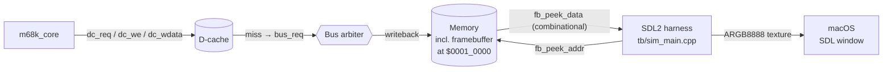

# Framebuffer and tiny cooperative OS

This document covers the framebuffer hardware path, the SDL2-based macOS
window the Verilator harness opens for the graphics demos, and a small
cooperative kernel written in 68000 assembly that runs three concurrent
tasks animating different regions of the framebuffer.

The framebuffer plumbing is general-purpose — you can drive it from any
68k program, with or without the OS. The OS is one example of how to
structure a program with multiple coroutines on top of the TAS primitive.

## Table of contents

1. [Memory map](#memory-map)
2. [Framebuffer hardware path](#framebuffer-hardware-path)
3. [SDL window](#sdl-window)
4. [Pixel format (RGB332)](#pixel-format-rgb332)
5. [No-OS demo: fb_demo.s](#no-os-demo-fb_demos)
6. [Cooperative OS design](#cooperative-os-design)
7. [Three-task demo: os_demo.s](#three-task-demo-os_demos)
8. [Building and running](#building-and-running)
9. [Extending the kernel](#extending-the-kernel)
10. [Limitations](#limitations)

## Memory map

When the demos are built (`make demo-fb` or `make demo-os`), the memory size
is bumped to 128 KB (`MEM_WORDS = 32768`) and N_CORES is forced to 1. The
extra space lets us carve out a 48 KB framebuffer alongside code and stacks.

```
$0000_0000 — $0000_03FF    256 exception vectors x 4 bytes (unused by demos)
$0000_0400 — $0000_3FFF    Code (.org $400)
$0000_4000                  Core 0 reset stack (kernel)        [grows down]
$0000_5000                  Task 0 stack (OS demo only)        [grows down]
$0000_6000                  Task 1 stack (OS demo only)        [grows down]
$0000_7000                  Task 2 stack (OS demo only)        [grows down]
$0000_8000 — $0000_823F    TCB table + OS globals (OS demo only)
$0001_0000 — $0001_BFFF    Framebuffer: 256 x 192 bytes (48 KB), RGB332
$FFFF_FFFC                  Memory-mapped IRQ register (unused by demos)
```

## Framebuffer hardware path

The framebuffer is just a region of normal main memory — no separate slave,
no DMA, no scanout state machine on the design side. Two pieces wire it to
the host display:

- **`rtl/m68k_bus.v` peek port.** A combinational read-only second port
  (`fb_peek_addr`, `fb_peek_data`) lets the simulator harness read any word
  of memory in zero CPU bus cycles. The CPU's normal bus traffic is
  untouched. In synthesis you would tie `fb_peek_addr` off; the peek wires
  are simulator-only by intent.
- **`rtl/m68k_top.v` plumbing.** The peek port is wired up through the SoC
  top to a pair of top-level signals that the C++ harness drives directly.



The peek is one 32-bit word per evaluation step. To read all 49152 bytes of
the framebuffer the harness performs 12288 word peeks at ~30 Hz wall clock.
On a modern Mac this is well under 1 % of simulation cost.

## SDL window

`tb/sim_main.cpp` gains a `run_graphics(...)` path when compiled with
`-DHAVE_SDL2`. The Makefile sets this automatically for the demo targets
when `sdl2-config` is on PATH.

The flow:

1. `SDL_CreateWindow` opens a 1024×768 logical window (256×192 scaled 4×).
2. The main loop ticks `CYCLES_PER_BATCH` (2000) simulator cycles, polls
   SDL events, then — if at least `WALL_FRAME_MS` (33 ms) has elapsed —
   scans the framebuffer, builds an ARGB8888 image, uploads to an
   `SDL_TEXTURE_STREAMING` texture, and renders.
3. Quits on `SDL_QUIT` (close button), Escape, or when every core halts.
4. On halt, the final frame stays visible until you press Escape; the
   window title flips to "(halted)".

The 30 FPS cap is wall-clock; the simulator runs as many cycles as it can
between renders. On an M-series Mac that's roughly 5–10 Mcycles per
visible frame.

## Pixel format (RGB332)

Every byte in the framebuffer is one pixel encoded as:

```
bit:  7   6   5   4   3   2   1   0
      R   R   R   G   G   G   B   B
      (3-bit red)  (3-bit green) (2-bit blue)
```

The harness builds a 256-entry ARGB8888 palette at startup that scales
each channel to 0..255:

```c
r8 = (r3 * 255) / 7;
g8 = (g3 * 255) / 7;
b8 = (b2 * 255) / 3;
```

So `$00` is black, `$FF` is white, `$E0` is bright red, `$1C` is bright
green, `$03` is bright blue.

## No-OS demo: fb_demo.s

`demos/fb_demo.s` is a single-task program that demonstrates the FB path
end-to-end. Each frame it:

1. Writes the entire 256×192 framebuffer pixel-by-pixel using `move.b
   D3, (A0)+`, where `D3 = (x + frame_counter) ^ y`. This produces a
   moving XOR pattern (the canonical "fire effect" precursor).
2. Computes a bouncing position for a 4×4 white block by reducing the
   frame counter mod 240 (for x) and mod 176 (for y), drawing the block
   with four `move.l #$FFFFFFFF, (A0)` writes.
3. Increments the frame counter, waits 500 cycles for pacing, and loops.

The whole program is ~50 lines of assembly and runs in an infinite loop —
ESC or window-close terminates it.

The key idioms it exercises:

- **Long-word fill for fast solid pixels.** `move.l #$FFFFFFFF, (A0)`
  writes 4 pixels at once.
- **Byte-precise pixel writes.** `move.b D3, (A0)+` writes a single
  pixel and advances. The `(An)+` post-increment uses size-aware step
  (+1 for `.b`, +2 for `.w`, +4 for `.l`).
- **Multiply-divide for bouncing motion.** `divu.w #240, D4` then
  `swap D4` gets the remainder (modulo).

## Cooperative OS design

`demos/os_demo.s` contains a self-contained kernel in about 80 lines of
assembly. The design is deliberately minimal:

- **One core, supervisor mode only.** All tasks run with `S=1`. No mode
  switches, no privilege checks, no MMU.
- **Cooperative.** No preemption. Each task must call `os_yield`
  periodically. There is no timer ISR, no periodic interrupt source.
- **Fixed task table.** 4 task slots laid out as a contiguous TCB
  array at `$0000_8000`. Each TCB is 16 bytes.
- **Caller-clobber yield.** `os_yield` does not save or restore the
  GPRs. Tasks must keep persistent state in memory across yields, not
  in registers. This makes the yield path extremely cheap (~12
  instructions) at the cost of a per-task convention.

### TCB layout

```
+0   sp     long  saved A7 of this task (with return PC on top of its stack)
+4   state  long  0 = free, 1 = ready
+8           reserved
+12          reserved
```

### Kernel data globals

```
$0000_8200   os_curr_task   long   index of currently running task (0..N-1)
$0000_8204   os_ntasks      long   number of tasks created
$0000_8208   frame counter  long   shared, incremented under mutex by task 0
$0000_820C   mutex byte     byte   TAS lock for the frame counter
$0000_8210   task 1 local frame counter
$0000_8214   task 2 local frame counter
```

### Scheduler state machine

```mermaid
stateDiagram-v2
    [*] --> reset
    reset --> os_init: bsr os_init
    os_init --> create_tasks: zero TCBs and globals
    create_tasks --> os_start: bsr os_task_create x N
    os_start --> task0: SP = tcb0.sp; rts pops task0 entry
    task0 --> os_yield: bsr os_yield
    os_yield --> task1: save SP into tcb[curr]; find next ready; SP = tcb[next].sp; rts
    task1 --> os_yield
    os_yield --> task2
    task2 --> os_yield
    os_yield --> task0
```



### How yield works

The trick that keeps yield small is that the 68000's RTS pops PC from the
stack. So:

- **On save**, the task's return-from-`BSR` PC is already on top of its own
  stack. The kernel just records the current SP into `tcb[curr].sp`.
- **On restore**, the kernel loads `tcb[next].sp` into A7 and does RTS.
  The pop reads the next task's saved PC and jumps there.

For a brand-new task that has never run, `os_task_create` manufactures the
same shape: it pushes the task's entry PC onto the task's stack and stores
the resulting SP in the TCB. When yield first picks that slot, RTS jumps
to the entry as if it were a return.

The full yield path (~12 instructions):

```asm
os_yield:
        move.l  $00008200, D0           ; D0 = curr
        move.l  D0, D1
        lsl.l   #4, D1                   ; D1 = curr * 16
        move.l  #$00008000, A0
        adda.l  D1, A0                   ; A0 = current TCB
        move.l  A7, (A0)                 ; tcb[curr].sp = SP
        move.l  $00008204, D2            ; D2 = ntasks
pick_lp:
        addq.l  #1, D0
        cmp.l   D2, D0
        blt     pick_in
        moveq   #0, D0
pick_in:
        move.l  D0, D1
        lsl.l   #4, D1
        move.l  #$00008000, A0
        adda.l  D1, A0
        move.l  4(A0), D3
        cmp.l   #1, D3
        bne     pick_lp                  ; not ready: try next
        move.l  D0, $00008200            ; curr = new
        move.l  (A0), A7                 ; SP = tcb[new].sp
        rts                              ; pop new task's PC
```

### Mutex primitive

Built on TAS. The lock byte is at `$0000_820C`. Acquiring under contention
yields back to the scheduler, so a blocked task doesn't busy-wait at the
TAS cost.

```asm
mutex_lock:
        move.l  #$0000820C, A0
mlock_spin:
        tas     (A0)
        beq     mlock_done           ; old byte was 0: we got it
        bsr     os_yield              ; let other tasks run
        bra     mlock_spin
mlock_done:
        rts

mutex_unlock:
        moveq   #0, D0
        move.b  D0, $0000820C
        rts
```

This is a "yield on contention" mutex — cheap, fair-ish (you always retry
after at least one other task ran), and correct because TAS is the
hardware atomic.

## Three-task demo: os_demo.s

The demo creates three tasks, each animating a horizontal stripe of the
framebuffer:

| task | rows      | pattern                                                   | tint  |
|------|-----------|-----------------------------------------------------------|-------|
| 0    | 0..63     | XOR pattern `(x + frame_global) ^ y` ORed into R channel | red   |
| 1    | 64..127   | Moving vertical bars `((x + 2*frame_local) >> 3) & 7` in G channel | green |
| 2    | 128..191  | Diagonal stripes `((x + y + frame_local) >> 2) & 3` in B channel | blue  |

Task 0 demonstrates the **mutex** by incrementing a global frame counter
inside the lock. Tasks 1 and 2 use their own local counters in memory
(no shared state, no mutex needed).

Each task draws its entire stripe (16384 byte writes) then calls
`os_yield`. With three tasks the kernel cycles round-robin, and each
stripe updates roughly 10–20× per second on a typical Mac.

If you let it run, you should see three clearly-distinct stripes each
moving at its own cadence — visual proof that the three coroutines are
making forward progress and that the mutex doesn't deadlock.

## Building and running

Prerequisites:

- `verilator` 5.x
- `python3`
- `sdl2` from Homebrew: `brew install sdl2`
- a C++17 compiler (Apple Clang is fine)

Targets:

```sh
make demo-fb     # framebuffer demo, no OS — opens window, runs forever
make demo-os     # cooperative OS demo, 3 tasks — opens window, runs forever
make demo        # alias for demo-os
```

Each target:

1. Builds a 1-core, 128 KB memory, SDL2-linked Verilator binary in
   `build_demo/`.
2. Assembles the demo `.s` to `build_demo/program.hex`.
3. Launches the binary with `--graphics`.

Press **Escape** or close the window to exit. The simulator runs up to
200,000,000 simulated cycles (well over a minute of wall time) before
timing out.

You can also run the binaries directly:

```sh
cd build_demo
python3 ../tb/asm68k.py ../demos/os_demo.s program.hex
./Vm68k_top 200000000 --graphics
```

## Extending the kernel

A few simple extensions, in roughly increasing order of effort:

### Add a fourth task

Bump `os_ntasks` (automatic in `os_task_create`), pick a new stack region
(e.g., `$0000_8000` … wait, that overlaps the TCB table; move OS data to
`$0000_C000` and use `$0000_8000`..`$0000_BFFF` for task 3's stack), and
call `os_task_create` once more in `reset`. Same TCB layout works.

### Add `os_sleep(ticks)`

You need a time source. The simplest is to add a tick counter that
`os_yield` bumps. Then `os_sleep(N)` is:

```asm
        ; read tick counter into D0
        add.l   #N, D0                   ; target tick
sleep_lp:
        bsr     os_yield
        cmp.l   tick_counter, D0
        bgt     sleep_lp
```

The cost is that `os_yield` is no longer single-purpose; it has a side
effect on time. For a more correct version, mark the task as
`state = SLEEPING` with a wake_at, and have the scheduler skip sleeping
tasks until the tick reaches their wake time.

### Preemption via the IRQ register

The memory-mapped IRQ at `$FFFF_FFFC` can be used as a timer interrupt
source if you have an external agent (a second core, or a small change
to the bus to fire on a cycle counter) that periodically writes a level.
The ISR could call into the scheduler. This requires saving GPRs on the
exception path because the preempted task does not know it's about to
lose the CPU; that's a real RTOS feature and a bigger change.

### Semaphores

Counting semaphore on top of the mutex:

```
sem_wait(s):
    loop:
        mutex_lock(s.lock)
        if s.count > 0: s.count--; mutex_unlock; return
        mutex_unlock
        os_yield
        goto loop

sem_post(s):
    mutex_lock(s.lock)
    s.count++
    mutex_unlock
```

### Inter-task message queues

A SPSC queue between two tasks needs no locks at all — see the queue
example in MULTICORE.md. For MPMC, wrap head/tail updates in mutex
locks.

## Limitations

- **No preemption.** A task that doesn't call `os_yield` starves all
  others. The demo's tasks all yield once per frame, so this is fine in
  practice. For a robust system you'd want a timer ISR.
- **No save/restore of GPRs.** Tasks must hold persistent state in
  memory. Programmer-facing convention; trivial to write correctly but
  hard to retrofit if you forget.
- **Single core.** The OS is single-core only. The other cores' state
  registers are unused. Adapting to multiple cores would need per-core
  task tables and per-core scheduler state, plus a way to start the
  scheduler on each core (currently the OS demo builds with
  `N_CORES = 1`).
- **Supervisor mode only.** There's no user/supervisor split; tasks have
  full hardware access. Privilege-violation traps are implemented in the
  ISA but not used by this kernel.
- **Fixed allocation.** No dynamic task creation or destruction (you can
  flip `state` to 0 / 1, but there's no malloc-style stack
  management).
- **No file I/O, no devices.** The framebuffer is the only "device" the
  simulator exposes. Adding more (a virtual UART, a virtual mouse, etc.)
  would follow the same peek-port pattern.
