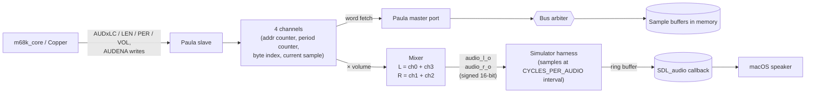

# Paula (4-voice audio engine)

Phase 4 of the Amiga-inspired chipset roadmap. Paula reads 8-bit signed
PCM samples from main memory via DMA on four independent channels,
applies per-channel volume, and outputs a mixed stereo signal that the
simulator's SDL_audio backend pipes to the OS audio device.

## Architecture



## Register map

Page at `$00FE_0200..$00FE_02FF` (256 bytes).

| Offset | Name      | Description                                                   |
|--------|-----------|---------------------------------------------------------------|
| `$00`  | AUDENA    | RW: low 4 bits = channel enables (bit 0 = ch0 ... bit 3 = ch3)|
| `$10`  | AUD0LC    | 32-bit byte address of channel 0's sample buffer              |
| `$14`  | AUD0LEN   | 16-bit word count (each word = 2 mono 8-bit samples)          |
| `$18`  | AUD0PER   | 16-bit period: system clocks between samples                  |
| `$1C`  | AUD0VOL   |  7-bit volume (0..64)                                         |
| `$20`  | AUD1LC    | ... channel 1 ...                                             |
| `$30`  | AUD2LC    | ... channel 2 ...                                             |
| `$40`  | AUD3LC    | ... channel 3 ...                                             |

Each channel uses the same `LC / LEN / PER / VOL` quartet.

Writing `AUDENA` with a bit toggling 0 → 1 re-initialises that
channel's running state (resets pointer to `LC`, words-left to `LEN`,
period counter to `PER`, sample to 0). Setting a bit 1 → 0 silences the
channel but does not affect the registers — you can pause and resume.

## Stereo routing

Amiga convention:
```
audio_l_o = ch0 + ch3
audio_r_o = ch1 + ch2
```

Each channel's contribution is `signed_sample × volume`, where sample
is 8 bits signed (-128..127) and volume is 0..64. Pre-mix range per
channel is roughly ±8128. Two channels mixed never exceed 16-bit range.

## DMA model

Each enabled channel maintains:
- `cur_addr`  : running byte address into the sample buffer (advances by 2 per word fetched).
- `words_left`: how many words remain in the current loop (decrements; reloads from `LEN` when 0).
- `word_q`    : last 16-bit word fetched.
- `word_valid`: 1 = `word_q` holds a usable word, 0 = needs DMA.
- `byte_idx`  : 0 = the next sample is the high byte of `word_q`, 1 = low byte.
- `per_cnt`   : countdown from `PER` to 0; on 0, emit next sample.

When `word_valid == 0` and the channel is enabled, the DMA arbiter
round-robins among needing channels and issues one bus read per cycle.
When the read completes, the word is latched and `word_valid` set.

Per-sample timing: while `per_cnt > 0`, decrement each clock. When 0:
emit the appropriate byte from `word_q` (high then low), reload
`per_cnt = PER`. If both bytes have been emitted, mark `word_valid = 0`
so the DMA arbiter fetches the next word.

When the running pointer would advance past `LC + 2*LEN`, the channel
reloads `cur_addr = LC` and `words_left = LEN`. **Continuous looping
playback by default** — there is no one-shot mode in this Paula.

## Differences from real Paula

| Real Paula                                | This implementation                            |
|-------------------------------------------|------------------------------------------------|
| 16-bit DMA pointer pairs (AUDxLCH/LCL)    | 32-bit single pointer (AUDxLC)                 |
| Period in 280 ns Paula ticks              | Period in simulator clocks                     |
| AUDxLENGTH in words, registers PT/LEN counter   | Same in concept                                |
| Modulation: PERIOD/VOL from another ch's data | **Not implemented** (could add later)      |
| One-shot mode (no DMA refetch after first pass) | **Not implemented**; we always loop      |
| Audio low-pass filter (Paula's 6 kHz RC)  | **Not implemented**; output is raw 8-bit PCM   |
| Disk + serial controllers (also Paula)    | Not modeled at all                             |
| Interrupt generation (INT7..INT11)        | Not modeled                                    |

What **is** identical in spirit:

- 4 independent channels with DMA-fetched 8-bit signed PCM
- Per-channel volume (0..64 range)
- AUDENA-style enable register
- Canonical L/R stereo routing (ch0+ch3 / ch1+ch2)
- Per-sample period control

## SDL_audio integration

The simulator's harness opens a 44.1 kHz, signed 16-bit, stereo audio
device at startup. The main render loop, after every
`CYCLES_PER_AUDIO` simulator cycles (default 100), reads
`top->audio_l` and `top->audio_r` and writes one `(L, R)` sample pair
into a lock-free ring buffer. SDL_audio's callback drains the ring at
its own pace; on underrun it outputs silence.

For audio rate to match SDL's, the Paula `PER` value should be tuned to
roughly `CYCLES_PER_AUDIO`. With both at 100, samples emitted by Paula
align with samples consumed by the harness, giving ~44 kHz playback.

## Tests

| test               | covers                                                  |
|--------------------|---------------------------------------------------------|
| `t29_paula_basic`  | Register round-trip (LC, LEN, PER, VOL, AUDENA).        |

(Audio output cannot be observed by the CPU — we trust the demo for
end-to-end verification.)

## Demo

`demos/paula_demo.s` writes a 100-sample square wave to memory at
`$5000` (50 positive + 50 negative 8-bit samples), programs Paula
channel 0 with `LEN=50`, `PER=100`, `VOL=50`, and enables AUDENA bit 0.
The CPU then enters an infinite loop while Paula plays an audible
~441 Hz square-wave tone via SDL_audio. Run via:

```sh
make demo-pau
```

The tone is intentionally a bit harsh — square waves are loud and rich
in harmonics. For a smoother sound, replace the sample buffer with a
proper sine table.

## What's next

The four phases are now complete. Future work that's already noted in
DESIGN.md and the per-phase docs:

- **Sprites** (Denise): 8 hardware sprites with collision detection.
- **Modulation** (Paula): period and volume modulation between channel pairs.
- **Audio filter**: emulate Paula's 6 kHz low-pass.
- **True scan-out Denise**: per-line rendering so Copper mid-line palette
  changes become possible.
- **Vectored interrupts** (CPU): IACK bus cycle support for non-autovector
  IRQs from Paula and the blitter.

This concludes the Amiga-inspired chipset arc.
