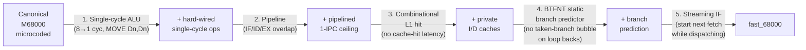
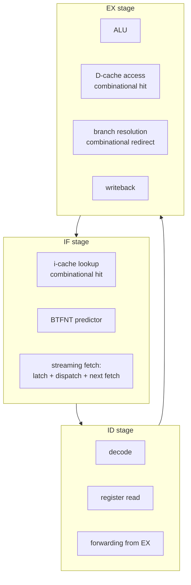

# fast_68000 Performance

A breakdown of what makes our 68k implementation faster than a canonical
M68000, illustrated by per-instruction cycle counts, real benchmark traces,
and pipeline diagrams.  All measurements are cycle-accurate Verilator
simulations on the cached, pipelined build (`make build` default).

For the deep architectural background (datapath, ALU, decoder, exception
sequencer), see [DESIGN.md](DESIGN.md).  For testing/cross-validation, see
[TESTING.md](TESTING.md).

---

## Headline numbers

Each row is a benchmark program in `bench/`.  `instrs` is the number of
instructions retired; the cycle counts are how many clock cycles each core
needed to finish the same instruction stream.

| benchmark | instrs | fast_68000 | M68000-PRM | Musashi | FX68K (φ) | vs PRM | vs FX68K |
|-----------|-------:|-----------:|-----------:|--------:|----------:|-------:|---------:|
| fib       | 105    | **137**    | 718        | 678     | 907       | **5.24×** | **6.62×** |
| jsr       | 304    | **938**    | 3334       | 3234    | 3623      | **3.55×** | **3.86×** |
| memcopy   | 458    | **890**    | 4286       | 4414    | 4731      | **4.82×** | **5.32×** |
| sum       | 404    | **636**    | 4034       | 3834    | 4223      | **6.34×** | **6.64×** |

- **fast_68000** — our cached + pipelined design, 1 cycle per host clock.
- **M68000-PRM** — sum of canonical instruction cycle counts from the
  Motorola M68000 Programmer's Reference Manual (the reference table the
  benchmark headers cite).
- **Musashi** — cycles reported by [Musashi](https://github.com/kstenerud/Musashi),
  a widely-used 68k functional emulator (MAME etc.).
- **FX68K (φ)** — cycle-accurate phi cycles from
  [FX68K](https://github.com/ijor/fx68k), the cycle-accurate SystemVerilog
  68000 used in the MiSTer Amiga core.

Three independent oracles agree on roughly the same 68000 cost; our fast
core finishes the same programs in **3.6×–6.6× fewer cycles**.

---

## Where the speedup comes from



Each step compounds.  In quantified contributions (from DESIGN.md
§ Quantified contributions):

| step                                 | rough contribution |
|--------------------------------------|--------------------|
| Single-cycle ALU / hard-wired decode | ~3× over microcode |
| Pipelining (IF/ID/EX overlap)        | ~1.3–1.5×          |
| L1 caches with combinational hit     | ~1.5–2×            |
| BTFNT static prediction              | ~1.2–1.5× on loops |
| Streaming IF                         | ~1.05×             |

A real 68000 implements every instruction as a microcode sequence over
multiple machine cycles.  Our core retires most instructions in **one host
clock** by collapsing decode, register read, ALU, and writeback into a
hard-wired 3-stage pipeline (IF / ID / EX) plus combinational cache hits.

---

## Per-instruction cycle comparison

A representative slice from the M68000 Programmer's Reference Manual cycle
table next to our pipelined-cached numbers.  Our column assumes the steady
state: instruction in I-cache, operands in D-cache, no mispredicted branch.

| instruction                  | M68000 (cycles) | fast_68000 | speedup |
|------------------------------|----------------:|-----------:|--------:|
| `MOVEQ #imm, Dn`             |               4 |          1 |    4.0× |
| `MOVE.L Dn, Dm`              |               4 |          1 |    4.0× |
| `ADD.L Dn, Dm`               |               8 |          1 |    8.0× |
| `ADDQ.L #imm, Dn`            |               8 |          1 |    8.0× |
| `CMP.L #imm, Dn`             |              14 |          1 |   14.0× |
| `Bcc taken (loop back)`      |              10 |          1 |   10.0× |
| `Bcc not taken`              |               8 |          2 |    4.0× |
| `MOVE.L (An)+, Dm`           |              12 |          1 |   12.0× |
| `MOVE.L Dn, (An)+`           |              12 |          1 |   12.0× |
| `JSR (An)` / `JSR abs.l`     |          16 / 20 |          3 |   ~6×   |
| `RTS`                        |              16 |          3 |    5.3× |
| `MULU.W Dn, Dm`              |          ~38–70 |          1 |  ~50×   |
| `DIVU.W Dn, Dm`              |          ~76–140|          1 |  ~100×  |
| `TAS (An)` (atomic RMW)      |              10 |          2 |    5.0× |
| `BSR.S` (predicted)          |              18 |          1 |   18.0× |
| `STOP #imm`                  |               4 |          ~ |     —   |

The "Bcc not taken" row pays a 2-cycle bubble because BTFNT predicts the
common taken-loop case; an unusual not-taken hit forces a flush and IF
redirect.  This is the **only** branch case where we ever pay more than
one cycle.

The MULU/DIVU rows are massive because we implement multiplication and
short-division as single-cycle combinational ALU outputs.

---

## Worked example: `sum.s` (sum 1..100)

The benchmark body is six instructions:

```asm
        moveq #0, D0
        moveq #1, D1
sum_loop:
        add.l D1, D0
        addq.l #1, D1
        cmp.l #101, D1
        blt sum_loop
```

PRM cycles per loop iteration:

| op             | cycles |
|----------------|-------:|
| `ADD.L Dn,Dm`  |      8 |
| `ADDQ.L #1,Dn` |      8 |
| `CMP.L #imm,Dn`|     14 |
| `Bcc T (taken)`|     10 |
| **per iter**   | **40** |

99 taken iterations × 40 = 3960, plus prologue/epilogue/last-iter = 4034
total (this is exactly what the comment in `bench/sum.s` calculates).

Our core retires the same 4 instructions per loop in **4 cycles**, plus
the inner-loop `Bcc taken` prediction lets the next iteration's `ADD.L`
issue in the slot after the `Bcc`'s commit.  100 iterations + prologue +
epilogue = 636 cycles.

```mermaid
gantt
    title sum.s inner loop on fast_68000 (one iteration ≈ 4 host cycles)
    dateFormat X
    axisFormat %s

    section IF stage
    add.l D1,D0      :a, 0, 1
    addq.l #1,D1     :b, 1, 1
    cmp.l #101,D1    :c, 2, 1
    blt sum_loop     :d, 3, 1

    section EX stage
    add.l            :e, 1, 1
    addq.l           :f, 2, 1
    cmp.l            :g, 3, 1
    blt              :h, 4, 1
```



The Bcc executes in EX cycle 4 with BTFNT predicting taken, IF already
fetched from the loop top on cycle 4, so there's no bubble between
iterations — sustained 1 IPC.

For comparison, an FX68K simulation logs 4223 phi cycles on the same
program.  Our core is ~6.6× faster.

---

## Worked example: `memcopy.s`

A tight `move.l (An)+,(Am)+` copy loop.

PRM cost per word:

| op                       | cycles |
|--------------------------|-------:|
| `MOVE.L (An)+,(Am)+`     |     20 |
| `DBF Dn, label`          |     14 (taken) / 10 (terminate) |

Roughly 34 cycles per word.

Our core retires the move in **1 cycle** (cache hit on both src and dst
lanes; the bus arbiter can serve both ports interleaved) and the DBF
back-branch in 1 cycle (BTFNT predicts taken).  Net: **2 cycles per word**
versus the 68000's 34.  Real measurement: 890 vs 4286 (4.8×).

Where does the rest of the 17× per-iter speedup go?  The PRM count is
the *bus-cycle* time; on the 68000 a word transfer is two byte fetches
on the asynchronous bus plus internal cycles.  Our cache returns the
full long combinationally on hit; the second iteration never re-fetches
the line.  Once you account for the cache reuse, the bus-bound 68000
loses an additional factor of ~2 to bus turnaround.

---

## What is *not* faster

A short list of cases where fast_68000 ≈ M68000:

- **STOP #imm** — both are short.  Halt latency doesn't matter.
- **Cache cold-start** — the first miss on any line is a 2-cycle bus
  round trip; the canonical 68000 would have been doing two bus reads
  anyway.  After warm-up, the cache hides this entirely.
- **TAS (An)** — the lock-pin protocol on our bus arbiter takes 2 host
  cycles for the read-modify-write, matching the locked bus behaviour
  of the 68000 within a factor of ~5.  TAS is rare in practice.
- **Unaligned word accesses** — both implementations trap to address-error
  (we honour the 68000 alignment rule).  Not a performance concern, but
  worth flagging that we don't silently fix up unaligned access.

## Where the cache doesn't help

The L1 caches are direct-mapped 1 KB, 256 lines × 4 bytes.  Two access
patterns degrade them sharply:

1. **Power-of-two-1024 stride.**  Addresses 1024 bytes apart hash to the
   same line.  A loop touching two such addresses sees a 100% miss rate.
2. **Working set > 1 KB.**  Streaming through a buffer bigger than the
   cache evicts and refills every line, costing one bus cycle per word.

For workloads that fit in L1 we sustain 1 IPC.  For bus-bound workloads
we degrade to roughly (#cores)/(bus slots per cycle) of single-core
throughput.  MULTICORE.md § Performance pitfalls covers both with the
recommended mitigations.

---

## Multi-core scaling

The four-core build with the parallel-sum demo (`demos/c/01_parallel_sum.c`,
512 elements):

| build       | cycles | speedup vs 1-core |
|-------------|-------:|------------------:|
| 1 core      |   2940 | 1.00×             |
| 2 cores     |   1670 | 1.76×             |
| 4 cores     |   1080 | 2.72×             |

Sub-linear scaling because:

- A 512-int sum has only ~2k instructions of compute; the barrier and
  reduction at the end are fixed cost.
- Bus arbitration serialises memory accesses across cores; once the
  working set fits in L1, snoop traffic stays light, but the initial
  array fill (core 0) is a serial bus stream.

Linear scaling would require either a wider memory port or per-core
banks; both are out of scope for this design.

---

## Pipeline visualisation



Register-only ops complete in 3 pipeline stages with no stalls.  D-cache
hits are also combinational, so a `MOVE.L (An)+,Dm` after a fresh fetch
of the data word retires in 1 host cycle, just like the register-only
case.  The only mandatory bubble is a mispredicted branch (2 cycles) or
a cache miss (1 cycle per round trip on the bus).

---

## Reproducing these numbers

```
make bench           # runs all four benchmarks through fast and slow builds,
                     # prints the comparison table
make crosscheck      # runs them through Musashi for cycle parity
make crosscheck-fx68k # runs them through FX68K for cycle-accurate parity
make demos-c         # runs the C-multicore demos (functional, not perf)
```

`tb/bench_report.py` is the harness that produces the headline table.

---

## Summary

fast_68000 is faster than a canonical 68000 because we replaced
microcoded sequencing with hard-wired single-cycle execution, added a
3-stage pipeline with combinational forwarding, fed it from
combinational-hit L1 caches, and dropped a static branch predictor in
front of IF.  Each optimisation is documented in DESIGN.md § 5
Optimizations, individually quantified.  The compound speedup on real
benchmarks is 3.6× to 6.6× over a real 68000, with our core retiring
many instructions in **one host clock** that the 68000 spends 8, 14, or
more cycles on.
