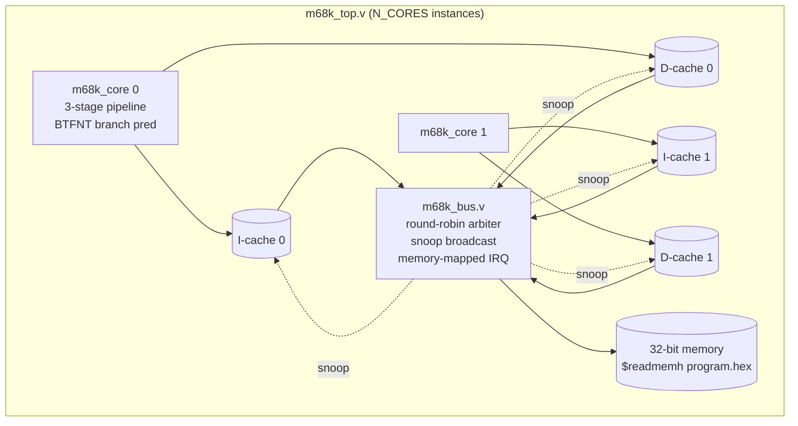
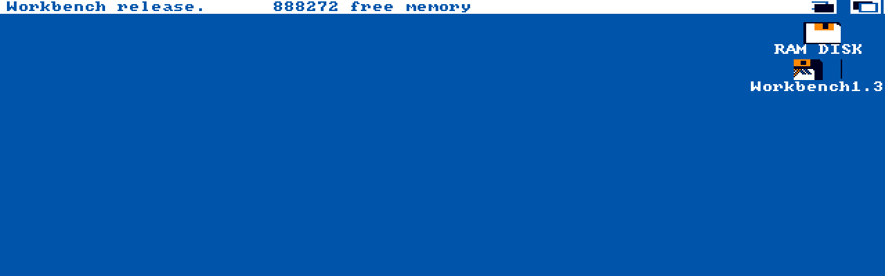

# fast_68000

A pipelined, cached, multi-core Motorola 68000 implementation in Verilog,
verified with Verilator. Implements a substantial subset of the M68000 ISA
(all three operand sizes, supervisor mode and exceptions, autovector
interrupts, MULU/MULS/DIVU/DIVS .W, MOVEM, DBcc, Scc, bit ops, shifts/rotates,
TAS), runs on N parameterically-instantiated cores with snoop-coherent L1
caches, and is **3.6×–6.4× faster** than the canonical 68000 PRM cycle counts
on the included benchmarks.



For the full design — pipeline, exception sequencer, memory subsystem,
bus arbiter, hardware-integration notes, and a workload-by-workload
performance breakdown — see [DESIGN.md](DESIGN.md). For the ISA encoding
reference, see [ISA.md](ISA.md). For a tutorial on writing programs that
exploit the multi-core capability (with assembly and illustrative C
examples), see [MULTICORE.md](MULTICORE.md). For the framebuffer,
SDL-based macOS window, and tiny cooperative-multitasking kernel demo,
see [OS.md](OS.md) — runnable via `make demo`. For the Amiga-inspired
clean-room blitter (copy / logic / Bresenham line modes, four channels,
8-bit minterm Logic Function, barrel shifts), see
[BLITTER.md](BLITTER.md) — line-drawing demo via `make demo-blt`.
For the Amiga-inspired Copper coprocessor (memory-resident display lists
driving the blitter autonomously), see [COPPER.md](COPPER.md) — demo via
`make demo-cop`. For Denise — the bitplane rasterizer with HAM6 / EHB /
dual-playfield / indexed display modes — see [DENISE.md](DENISE.md);
demo via `make demo-den`. For Paula — 4-voice 8-bit PCM audio routed
through SDL_audio — see [PAULA.md](PAULA.md); demo via `make demo-pau`.

## Workbench 1.3 booting on the Verilog Amiga

Run `make wb-desktop` to boot the real K1.3 ROM and Workbench 1.3 ADF
through to the Workbench desktop:



— RAM DISK auto-mount, Workbench1.3 disk icon, "Workbench release.
888272 free memory" title, drive + battery indicators in the upper
right.  Rendered from chip RAM at retired = 208M instructions
(post-CLI desktop init).  No `MEM_POKE`, no hacks — the unmodified
ROM + ADF reaches this state via the real trackdisk MFM-decode +
Intuition + Workbench paths.

## Headline numbers

```
benchmark   retired  68k_ref cpi_ref    fast cpi_fast    slow cpi_slow  vs_68k  vs_slow
fib             105      718    6.84     133     1.27     338     3.22   5.40x    2.54x
jsr             304     3334   10.97     934     3.07    1835     6.04   3.57x    1.96x
memcopy         458     4286    9.36     888     1.94    1669     3.64   4.83x    1.88x
sum             404     4034    9.99     632     1.56    1835     4.54   6.38x    2.90x
```

- `vs_68k` is the ratio of canonical 68000 PRM cycles to our cycles for the
  same instruction trace. The cached + pipelined build is **3.6×–6.4×** faster.
- `vs_slow` isolates the cache contribution by comparing against a no-cache
  build of the same pipeline.

## Microarchitecture in a nutshell

- **3-stage pipeline** — IF (streaming opcode + extension words, BTFNT
  prediction, speculative fetch), ID (combinational decode + forwarding),
  EX (state machine: register, load, store, RMW, MOVEM, exception).
- **Per-core L1 caches** — 1 KB instruction + 1 KB data, direct-mapped,
  combinational read hit. D-cache is write-through with no-write-allocate.
- **Snoop coherence** — every accepted bus write is broadcast; peer caches
  invalidate matching lines. Self-modifying code works for free.
- **Locked RMW (TAS)** — bus arbiter pins the bus to the lock holder across
  the second transaction, so TAS is atomic against all other ports.
- **Multi-core** — `N_CORES` is a parameter, tested at 1, 2, and 4. Each
  core gets a private stack from its `CORE_ID`.
- **Supervisor + exceptions** — S/T/I bits, USP/SSP swap, multi-cycle
  exception sequencer (PUSH_PC → PUSH_SR → FETCH), autovector IRQ 1..7 via
  memory-mapped register at `$FFFF_FFFC`.

## Repo layout

```
rtl/
  m68k_defs.vh       constants
  m68k_alu.v         32-bit ALU with NZVCX flags
  m68k_regfile.v     16-entry, 3R/2W register file
  m68k_decoder.v     16-bit opcode → control bundle
  m68k_cache.v       direct-mapped, write-through, snooping L1
  m68k_passthrough.v pin-compatible no-cache shim (USE_CACHE=0)
  m68k_bus.v         round-robin arbiter, snoop broadcast, IRQ register
  m68k_core.v        3-stage pipelined core
  m68k_top.v         N-core SoC top
tb/
  asm68k.py          single-file 68K assembler → program.hex
  sim_main.cpp       Verilator C++ harness
  bench_report.py    fast vs. slow vs. 68000-PRM table
tests/               t01..t18 regression programs (.s)
bench/               benchmark programs with reference cycle counts
DESIGN.md            comprehensive architecture document
ISA.md               instruction-encoding reference
```

## Running

```sh
make test                 # default 2 cores, build + run every regression test
make test-all             # test + test-ovl + DMA snoop + minimig + arbiter xchecks
make bench                # build two 1-core sims (cache on/off), print table
make N_CORES=4 build      # rebuild the multi-core sim for 4 cores
make clean                # remove build/ and per-test logs
make crosscheck-arbiter   # exercise agnus_arbiter slot reservations (Phases B/C/D/E/F)
make wb-screenshot        # boot K1.3+WB1.3 to CLI banner; render PNG
make wb-desktop           # boot K1.3+WB1.3 deep into Workbench desktop (icons, RAM disk)
EXTRA_VERI_DEFS=+define+SLOT_ACCURATE_AGNUS make test    # CPU under slot-accurate Agnus timing
```

Prerequisites: **Verilator 5.x**, **Python 3** (assembler + bench runner),
a C++17 compiler reachable by Verilator (clang or g++).

## Tests

All 18 regression tests pass under `N_CORES = {1, 2, 4}` and `USE_CACHE = {0, 1}`.

| test              | covers                                                      |
|-------------------|-------------------------------------------------------------|
| `t01_basic`       | reset, NOP, STOP                                            |
| `t02_arith`       | MOVEQ, ADD, SUB, CMP+BEQ, AND                               |
| `t03_loop`        | ADDQ, signed-conditional branch loop                        |
| `t04_memory`      | `(An)+`, `-(An)`, per-core branch by SP                     |
| `t05_call`        | BSR/RTS, JSR abs.L, recursion + stack                       |
| `t06_multicore`   | TAS-protected shared counter, two cores                     |
| `t07_coherence`   | producer/consumer ping-pong via shared memory + snoop       |
| `t08_new_insns`   | EXT, SWAP, EXG, NEG/NOT (Dn), CLR/TST, LINK/UNLK, PEA       |
| `t09_loops`       | DBcc/DBRA across all 16 conditions; shift/rotate forms      |
| `t10_muldiv`      | MULU/MULS/DIVU/DIVS .W; BTST/BCHG/BCLR/BSET static & dyn; Scc |
| `t11_trap`        | TRAP #N → vector 32+N; RTE; ILLEGAL opcode (vec 4)          |
| `t12_supervisor`  | S-bit, USP/SSP swap, MOVE-USP, privilege violation (vec 8)  |
| `t13_exceptions`  | DIVU-by-zero (vec 5), TRAPV (vec 7); ANDI/ORI/EORI CCR/SR   |
| `t14_chk_rtr`     | CHK (vec 6 on out-of-range); RTR (CCR + PC restore)         |
| `t15_irq`         | autovector IRQs 1..7 via memory-mapped IRQ register         |
| `t16_memdest`     | NEG.B/NEG.W/NOT.B memory-dest RMW; CLR mem, TST mem         |
| `t17_movem`       | MOVEM.L reglist↔-(An)/+(An)/(An), prologue/epilogue         |
| `t18_disp`        | d16(An) addressing: read, write, mixed with autoinc         |

Run a single test by hand:

```sh
python3 tb/asm68k.py tests/t03_loop.s build/program.hex
(cd build && ./Vm68k_top 50000)
```

Output convention: `code=0x0000` is pass, anything else is a specific
failure marker the program chose. Halt code `0xFFFE` means the harness hit
its cycle cap.

## Benchmarks

`make bench` runs every `bench/*.s` program on a fast (cached + pipelined)
and a slow (no-cache, same pipeline) build and prints the comparison table
above against canonical 68000 PRM cycles. The benchmarks:

| name      | what it stresses                                          |
|-----------|-----------------------------------------------------------|
| `sum`     | tight ALU loop: ADD + ADDQ + CMP + Bcc                    |
| `fib`     | iterative Fibonacci, all register-resident                |
| `memcopy` | streaming loads/stores through `(An)+`                    |
| `jsr`     | JSR abs.L + RTS overhead, 50 subroutine calls             |

## What's it good at (and what isn't)

**Best speedup (5–6×):** tight register-only inner loops with backward
branches — DSP-style kernels, integer sums, polynomial evaluation,
hash inner loops, anything that fits in 1 KB of code and stays in
D0–D7.

**Smaller speedup (3×):** subroutine-heavy code, dispatchers, indirect
branches — there is no return-stack predictor or branch target buffer,
so every JSR/RTS flushes the pipeline.

**See [DESIGN.md § Performance benefits](DESIGN.md#performance-benefits-what-workloads-benefit-most)**
for the full per-class instruction-cycle table and a workload analysis
of where each microarchitectural feature contributes.

## Replacing a real 68000

Using this as a drop-in 68000 takes some glue logic — most notably a bus
converter that translates this core's synchronous handshake into the real
chip's asynchronous /AS / /UDS / /LDS / /DTACK protocol, plus a 16-bit
external data path. The full pin-by-pin mapping, FPGA targeting notes,
and ISA-gap list lives in
[DESIGN.md § Hardware integration](DESIGN.md#hardware-integration-replacing-a-real-68000).
