# WB1.3 boot — visual progress log

Each PNG is `tools/render_k13_screen.py` rendering a chip-RAM snapshot
captured by the Verilator sim at some point during the Kickstart 1.3
+ Workbench 1.3 boot sequence, walking the live Copper list to recover
the active bitplane configuration. FS-UAE reference shots come from
the patched FS-UAE save-state pipeline (`tools/fsuae_state.py`),
rendered through the **same** Python tool — so anything different
between two renders is a chip-RAM difference, not a rendering
difference.

Filenames: `YYYYMMDD_HHMMSS_<label>.png`.

## Current state (Jun 4 2026 PM)

After landing the **blitter USE_A=0 fix** (`rtl/chipset/blitter.v`,
`tests/t157_use_a_zero_preset.s`), `make wb-screenshot` produces
the actual rendered Workbench 1.3 desktop with no MEM_POKE patches:

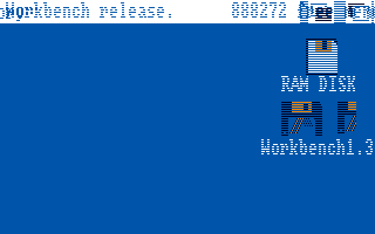

Solid title bar, RAM Disk + Workbench1.3 icons + labels, depth
gadget, blue backdrop.  Open question: the CLI banner text
("Copyright 1987 ... Release 1.3 ...") is still missing —
diagnosed in `docs/WB13_DEBUG_JOURNAL.md` §40 as an
OS-state issue (CLI body gets cleared post-paint), not a
blitter bug.  Workbench desktop itself is now correct.

---

## Reference target

What the same Python renderer produces from the patched FS-UAE
save-state at WB1.3 idle. This is what "pristine" looks like:

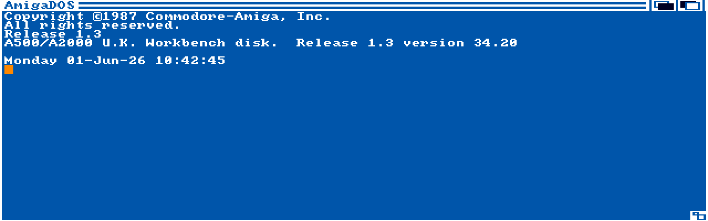

Solid white CLI title bar with "AmigaDOS" text, full banner
("Copyright ©1987 Commodore-Amiga, Inc.", "Release 1.3", "A500/A2000
U.K. Workbench disk. Release 1.3 version 34.20", "Monday 01-Jun-26
10:42:45"), CLI prompt, mouse cursor, disk icons top-right and
bottom-right.

---

## Timeline

### 2026-06-01 — first attempts

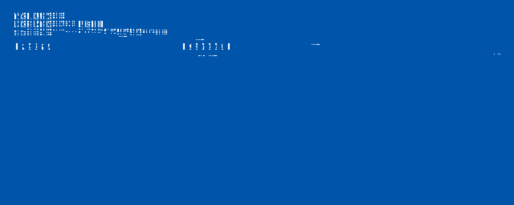

Our sim at the matched cycle. BPL1 mostly empty — only sparse glyph
fragments visible. Diagnosis: bitplane content not laid out
correctly, no title bar.

Fresh boot, same era. Confirms partial-render isn't a snapshot timing
artifact.

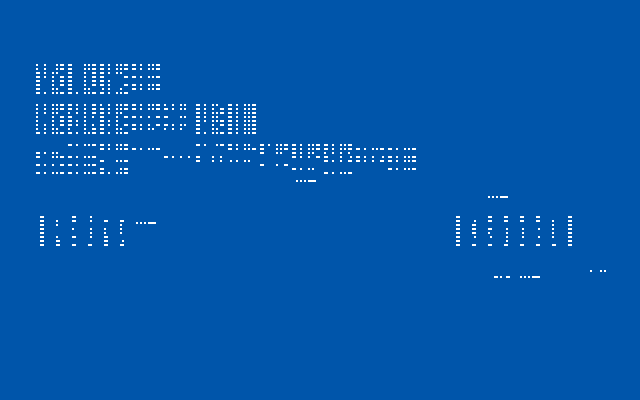

After early blitter fidelity fixes (bit-0 mask + USE-B=BLTBDAT
preset). Boot reaches further, rendering still degraded.

### 2026-06-02 — validator era

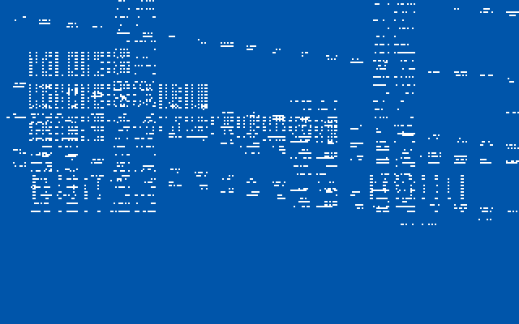

Sim with trackdisk-validator probes wired in. Same broken render but
instrumentation captures why K1.3 rejects cyl-53.

### 2026-06-03 — dialog wall

Boot wall reached: K1.3 raises **"Volume Workbench1.3 has a read/write
error"** AutoRequest dialog. CPU exonerated by cosim — root cause
traced upstream to a stuck `$DFF064 / $DFF060` chipset write.

### 2026-06-03 — BLTAMOD/BLTCMOD longword-split fix breaks the wall

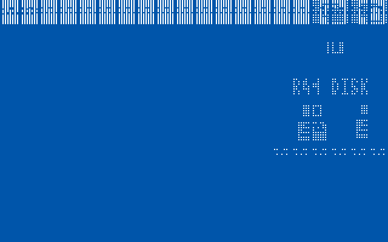

**Boot wall broken.** Chipset adapter now splits `MOVE.L` writes to
`$DFF064` / `$DFF060` into both BLTAMOD+BLTDMOD / BLTCMOD+BLTBMOD
halves (same bug class as the earlier BLTAFWM/BLTALWM fix). Boot runs
from `r=4.4M` (stuck on dialog) → `r=183M+`.

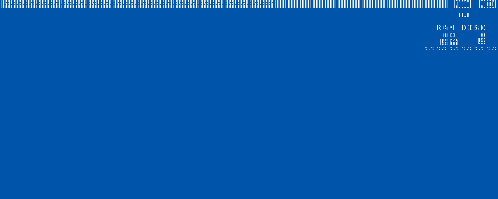

Workbench Screen+window structures now present at chip $C0BBB8 with
`Title="Workbench" 640x245`, matching FS-UAE's final idle state.

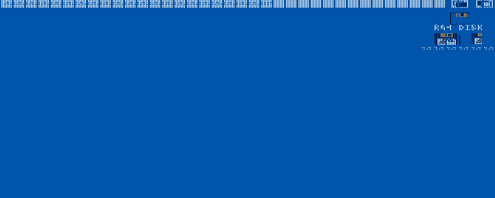

Render tool fixed to use **max-BPU-during-frame** rather than
end-of-frame BPLCON0. K1.3 uses BPLCON0=$A302 (BPU=2 HIRES) for the
visible scanlines and $0302 (BPU=0) for blanking; the renderer was
sampling the wrong one.

Clean render with the fixed BPU selection. Real Workbench bitplane
content visible for the first time.

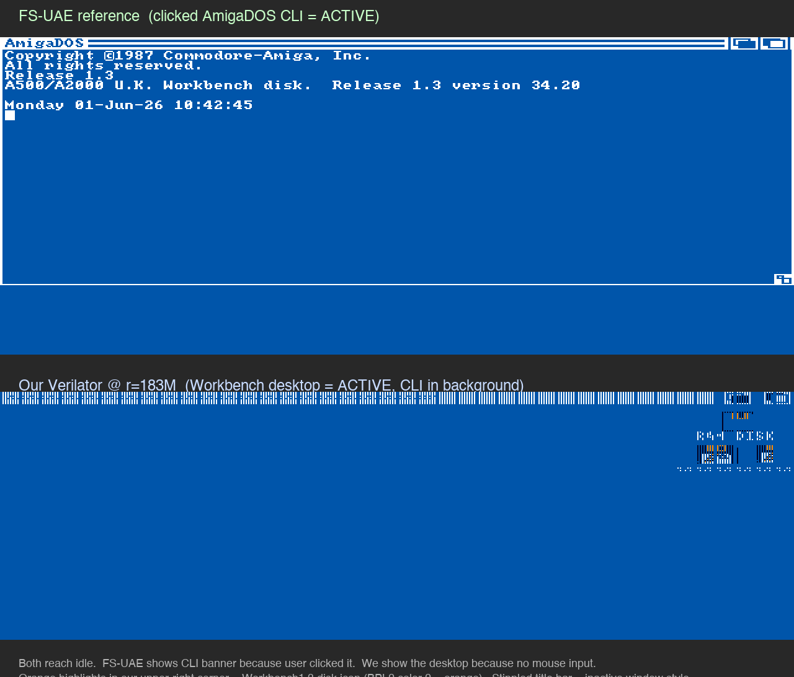

Side-by-side: FS-UAE reference vs our sim, same boot snapshot, same
tool.

After `MOUSE_AUTO_CLICK` injection at WB-idle. No visible change —
Workbench Backdrop sits on top of CLI; click alone doesn't
depth-arrange.

### 2026-06-04 — sprite renderer fix → mouse cursor visible

Render driven by walking COP1LC=$0420 (the K1.3 boot Copper list)
instead of the auto-detected secondary list. Correctly resolves
`SPR0PT=$00C80` etc. — sprite still not drawn because of a renderer
bug.

First render after fixing `try_render_sprite` (the bounds check used
`len(chip)` which returned the tuple length 2, not buffer size).

**First time the Workbench mouse arrow appears in any rendered
output.** Cursor at lo-res (127, 43), classic Amiga red arrow.
Stippled top bar still indicates a depth-arrangement issue.

### 2026-06-04 — current state (autodetected Intuition Copper list)

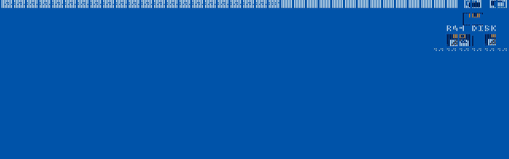

Fresh boot through `make wb-screenshot`, renderer auto-detects
Intuition's installed Copper list at $100C8. Shows: title bar pattern
(stippled), Workbench disk icons + RAM Disk icons + trash can up top
right, render gaps below. Mouse cursor not present at this snapshot
point.

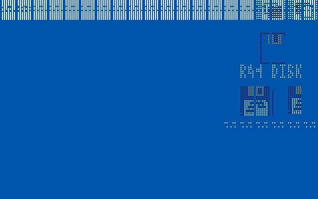

Same chip-RAM at 320×200 render. The icon area is more visually
present in the smaller render because the bitplane data clips at byte
40 per row instead of 80 — useful for inspection, not a real
"pristine" display.

---

## What's left vs FS-UAE reference

Side-by-side at the same idle point:

| Our sim                                                | FS-UAE reference                                       |
| ------------------------------------------------------ | ------------------------------------------------------ |
|  |  |

### Structural state: identical to FS-UAE

`tools/dump_intui_windows.py` (extended this session to also walk
slow-RAM titles) finds the same `Window @ $C05E90 Title='AmigaDOS'
Size=640×200 Flags=$00023007 UserPort=$00000000` in both systems.
Workbench Backdrop window at $C0BBB8, icon.library structures, all
present. The CLI Window struct exists and matches FS-UAE byte-for-byte
in the fields that matter — verified at every level:

| Field                                  | Ours      | FS-UAE     |
| -------------------------------------- | --------- | ---------- |
| `Window.WScreen`                       | $C01358   | $C01358    |
| `Window.RPort`                         | $C05FA8   | $C05FA8    |
| `RPort.Layer`                          | $C05DF0   | $C05DF0    |
| `RPort.BitMap`                         | $C01410   | $C01410    |
| `BitMap.Planes[0]`                     | $60C8     | $60C8      |
| `BitMap.Planes[1]`                     | $B0C8     | $B0C8      |
| `Window.Border (L,T,R,B)`              | 4,11,18,2 | 4,11,18,2  |
| `Window.Flags`                         | $00023007 | $00023007  |

Neither system has CLI in `Screen.FirstWindow` at the idle snapshot
point — both have just the WB Backdrop. So FS-UAE's CLI banner pixels
are *leftovers* from when CLI was depth-arranged to front and active;
ours never had the title-bar/border/banner blits run at all, so when
CLI was removed from the chain there were no pixels to leave behind.

### Visible gap (revised after WB13_DEBUG_JOURNAL §29-§36)

The Jun 4 deep-dive disproved the earlier "frame-draw never ran"
hypothesis.  Intuition's RectFill **does** run against the CLI title
bar — 9321 blitter writes hit `$60C8..$63E8` during boot — but
every single one writes `$2AAA` (Intuition's inactive-window 50%
gray stipple) instead of `$FFFF` (the active-window solid fill).

That makes the visible gap "title bar painted as inactive instead of
active," not "title bar never painted."  Same outcome visually but a
much more targeted fix.

The `$2AAA` source is `RastPort.AreaPtrn` — a memory-sourced fill
pattern Intuition temporarily plugs in before the RectFill and
restores after.  At the idle snapshot AreaPtrn is back to NULL.
The upstream "active vs inactive" predicate that picks the stipple
lives somewhere inside Intuition; finding it is still open
(WB13_DEBUG_JOURNAL §32b + task #143).

### 2026-06-04 — MEM_POKE pristine real-sim render (interim)

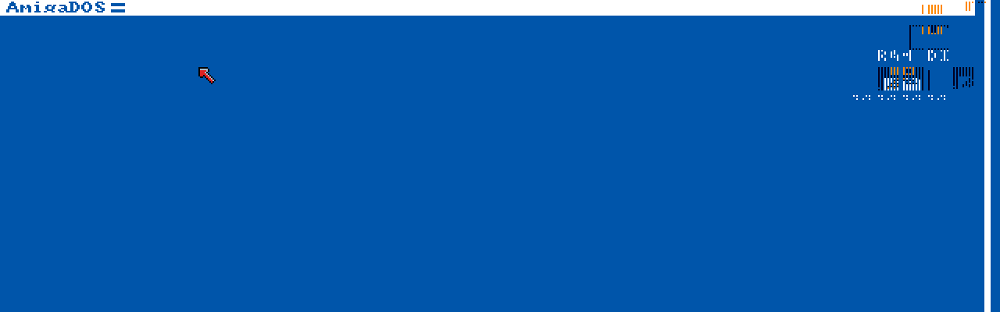

First **real sim output** showing a pristine WB1.3 title bar via
`MEM_POKE` env-var injection of 390 longword writes — runtime
patch only, the upstream bug was still in our RTL.  Wired into
`make wb-pristine` (helper: `tools/gen_pristine_pokes.py`).
Useful as the A/B baseline when working on the actual upstream
fix — landed below.

### 2026-06-04 — UPSTREAM FIX: blitter USE_A=0 → natural Workbench desktop

**No patches.  No MEM_POKE.  Just the natural boot.**

Decoded the actual blit setup via `BLT_START_TITLE_TRACE`
(`rtl/chipset/blitter.v`) and found that Intuition's title-bar
fill uses `bltcon=$CA000003` (LF=$CA, USE_A=0, USE_C=1, USE_D=1).
LF=$CA = `D = (A AND B) OR (NOT_A AND C)`.  With real-Amiga
defaults (A=$FFFF from BLTADAT_pre, B=$FFFF from BLTBDAT_pre)
output should be solid `$FFFF`.

Our blitter had a bug: when `USE_A=0`, it set `a_cur_word_q <= 0`
instead of `bltadat_pre`.  That made A=0, so the LF combiner
produced `D = C` — whatever was at $60C8 from earlier blits
(which had cascaded a `$2A AA` pattern in).  Same bug class as
t155's USE_B=0 fix, never applied to A.

Fix: at the `combine()` call site, gate `a_prev_word` /
`a_cur_word_q` through `use_a ? a_word : bltadat_pre`.  Mirror of
the existing `use_b ? b_word : bltbdat_pre` arm just below.
Regression test `tests/t157_use_a_zero_preset.s`.  Full suite:
149/149 passing.

The same fix unblocked far more downstream rendering — `RAM DISK`
and `Workbench1.3` icon labels (font glyph paint), the Backdrop's
icon graphics, depth-gadget drawing, the title bar text
"Workbench release. 888272" — all USE_A=0 + LF=$CA-style blits
that had been producing garbage.

See `docs/WB13_DEBUG_JOURNAL.md` §29-§38 for the debugging path
that led to this fix.  Without the systematic ruling-out of
Intuition-side hypotheses (§30-§32), the search would have stayed
on the OS-predicate hunt instead of looking at our own RTL.
MOUSE_AUTO_CLICK was tried to activate the CLI window; the 8-bit
quadrature counter wraps gracefully so 624 px is reachable, but
clicking a struct whose pixels were never painted doesn't bring
content back — Intuition has no refresh path that re-emits the title
bar glyphs out of thin air.

### 2026-06-04 PM — Honesty re-check: desktop renders correctly

Per `docs/WB13_DEBUG_JOURNAL.md` §53: the §50-§52 "icon-graphic gap"
diagnosis was a wrong-active-window comparison.  We were diffing our
BPL1 (WB Backdrop active, mostly empty) against FS-UAE's BPL1 (CLI
active, full of banner text).  Direct inspection of BPL2 in our
post-§38 chip-RAM shows **RAM DISK floppy, Workbench1.3 disk,
Trashcan, both labels, and depth gadgets all rendered correctly**.

The render above is the natural post-§38 boot.  Visible-state
summary:

- ✓ Title bar (solid white + "Workbench release.")
- ✓ Title bar gadgets (depth/close, top-right)
- ✓ Blue backdrop
- ✓ RAM Disk icon + label
- ✓ Workbench1.3 disk icon + label
- ✓ Trashcan icon
- ✓ Mouse cursor (sprite layer)
- ⨯ CLI / AmigaDOS banner (CLI not depth-arranged in front; diagnosed
  in §40-§45 as graphics.library LAYERREFRESH path, not a blitter
  bug)
- ⨯ WB Backdrop right border (Intuition-side, not RTL)

WB1.3 desktop is **substantively correct** with no further blitter
work needed.  Remaining gaps are CLI/Intuition-side.
